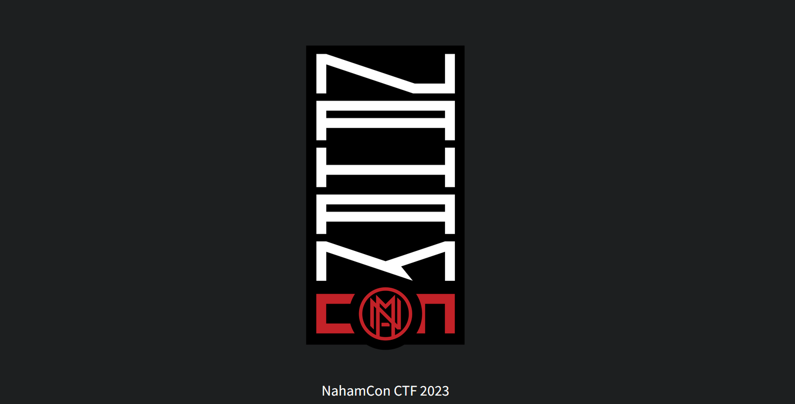
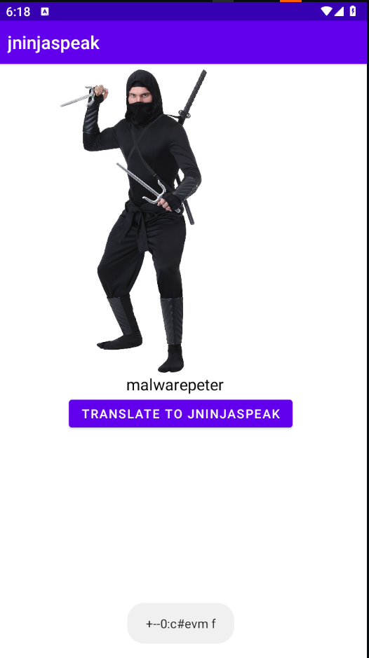
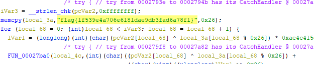
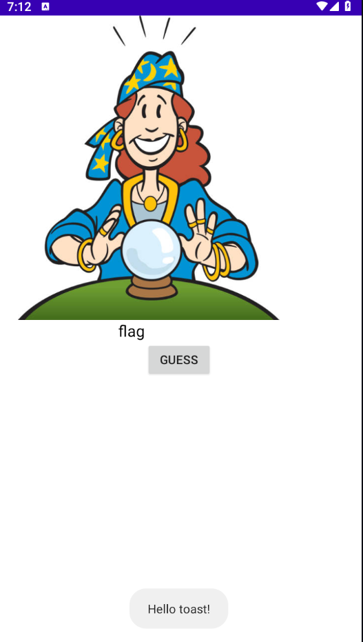
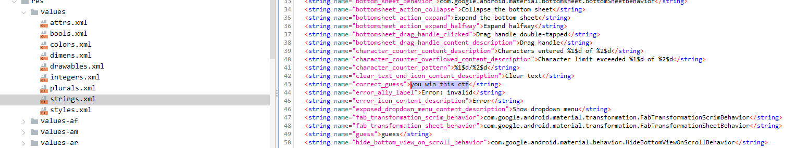
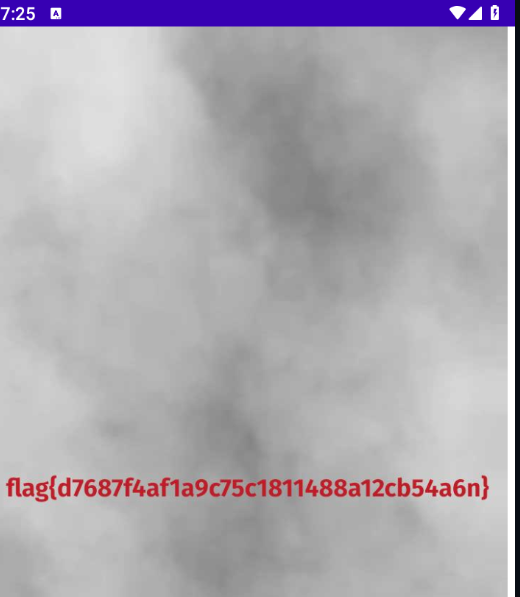
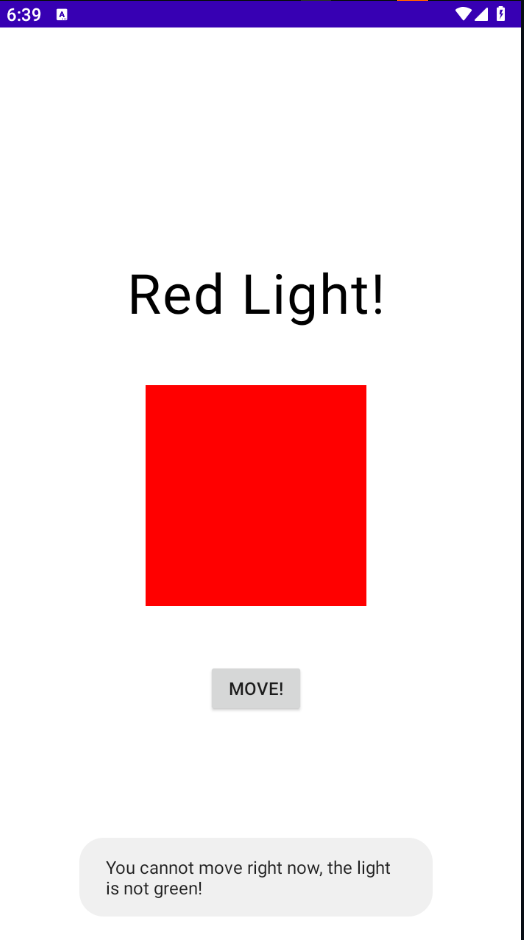
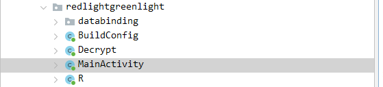
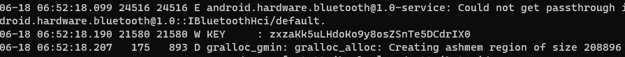
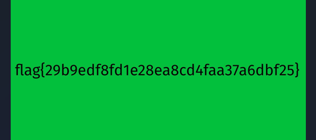

**Hi**
I participated in the NahamCon CTF 2023 and dedicated some time over the weekend to solve several interesting questions. Here, I would like to share a few of the intriguing questions that I was able to solve




# Android | Mobile


## JNInjaspeak

We are all very familiar with Leetspeak, can you crack the code on how JNInjaspeak works


**walkthrough :**
its android App,
open it , type a word, it get converted into special characters



lets see,
using jadx to decompile APK and going to to MainActivity class

found this on bottom
```
    static {
        System.loadLibrary("jninjaspeak");
    }

```
JNI is the Java Native Interface; means it use some of c++ or c,well must have a binary somewhere

i decided to check on my android data folder and pull

```bash
adb pull /data/data/com.nahamcon2023.jninjaspeak/lib/libjninjaspeak.so .
```

open on Ghidra
found a flag



BOOM!!

---


## Fortune Teller

Can you guess what fortune the fortune teller is thinking of? 


**walkthrough :**
its APK again, open the application we are supposed to gues the correct word so we can get a flag



lets decompile with jadx 

found two crucial classes to look
 - Decrypt
 - MainActivity

 


under MainActivity Class
 ```
     public final void guess(View v) {
        Intrinsics.checkNotNullParameter(v, "v");
        Companion companion = Companion;
        companion.setGuessString(getGuessInput().getText().toString());
        String string = getString(R.string.correct_guess);
        Intrinsics.checkNotNullExpressionValue(string, "getString(R.string.correct_guess)");
        setCorrectString(string);
        if (Intrinsics.areEqual(companion.getGuessString(), getCorrectString())) {
            ImageView imageView = new ImageView(this);
            setContentView(imageView);
            getDecrypt().decrypt(this);
            Bitmap bitmap = BitmapFactory.decodeFile(getDecrypt().getOutputFile().getAbsolutePath());
            imageView.setImageBitmap(bitmap);
            return;
        }
        Toast toast = Toast.makeText(this, "Hello toast!", 0);
        toast.show();
    }

 ```

 from above code we can see

 ```
 R.string.correct_guess
 ```
This is hardcoded string variable, it Can hold our value LOl, lets get it

under res/values/strings.xml



as seen above, we got the value, lets enter on the application



boom!!!

---

## Red Light Green Light

You are stuck in a game of red light green light, to win you need to press the button when the light is green. Wait all you want, the light has never changed to green for me 


**walkthrough :**
open the application. there is button that help us to move, it supposed to change to green to get a flag



lets decompile with jadx 

found two crucial classes to look
 - Decrypt
 - MainActivity



under Decrypt class you can see crucial method , it took encrypted file under raw/encrypted the decrypt it using RSA key 

```

    public final void decrypt(Context context, String key) {
        Intrinsics.checkNotNullParameter(context, "context");
        Intrinsics.checkNotNullParameter(key, "key");
        InputStream openRawResource = context.getResources().openRawResource(2131689472);
        Intrinsics.checkNotNullExpressionValue(openRawResource, "context.resources.openRawResource(R.raw.encrypted)");
        byte[] readBytes = ByteStreamsKt.readBytes(openRawResource);
        File filesDir = context.getFilesDir();
        byte[] sliceArray = ArraysKt.sliceArray(readBytes, RangesKt.until(16, readBytes.length));
        byte[] bytes = key.getBytes(Charsets.UTF_8);
        Intrinsics.checkNotNullExpressionValue(bytes, "this as java.lang.String).getBytes(charset)");
        SecretKeySpec secretKeySpec = new SecretKeySpec(bytes, "AES");
        IvParameterSpec ivParameterSpec = new IvParameterSpec(ArraysKt.sliceArray(readBytes, RangesKt.until(0, 16)));
        Cipher cipher = Cipher.getInstance("AES/CBC/PKCS5Padding");
        cipher.init(2, secretKeySpec, ivParameterSpec);
        byte[] doFinal = cipher.doFinal(sliceArray);
        setOutputFile(new File(filesDir, "decrypted.jpeg"));
        FileOutputStream fileOutputStream = new FileOutputStream(getOutputFile());
        fileOutputStream.write(doFinal);
        fileOutputStream.close();
    }
```

well so if we know the key, we can go our way since we also have encypted file

under MainActivity,i  noticed this line

```
Log.w("KEY", getKey());

```

it actualy logcat function, where it print a value of key on console,lets get it

open my adb shell and run logcat, and get the key



got the key, now lets write a python code to decode

```
# created by malwarepeter 17/06/2023
import os
import io
from Crypto.Cipher import AES
from Crypto.Util.Padding import unpad

def decrypt(context, key):
    encrypted_file_path ="encrypted"
    output_file_path = "decrypted.jpg"

    with open(encrypted_file_path, "rb") as file:
        encrypted_data = file.read()

    iv = encrypted_data[:16]
    ciphertext = encrypted_data[16:]

    key_bytes = key.encode("utf-8")
    cipher = AES.new(key_bytes, AES.MODE_CBC, iv)
    decrypted_data = unpad(cipher.decrypt(ciphertext), AES.block_size)

    with open(output_file_path, "wb") as file:
        file.write(decrypted_data)

# Specify the filename and key
encrypted_filename = 'encrypted'
encryption_key = 'zxzaKk5uLHdoKo9y8osZSnTe5DCdrIX0'

# Decrypt the file and save as a JPEG image
decrypt(encrypted_filename, encryption_key)


```

run it , and we get decrypted image file




---


I solved 3 out of 5 Mobile challenges, always enjoying NahamCon CTF on this catergory,
