**Hi**,
today am going to show you i solved a week one of Africa Digital forensic Competiton powered by United Nations Office on Drugs and Crime (UNODC) which is third time now under their programme called GLOBAL PROGRAMME on CYBER CRIME

here we go 


## HashPotatos - (2 pts)

What is the SHA256 hash of the compressed Android data?
answer: **aeb95fe9ed2dabefef786c3dc620b0cd92255476c7a9be01049cb05d995a39f9**

**walkthrough :**
using sha256sum

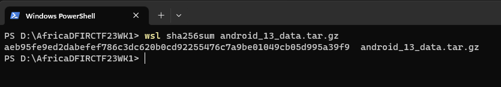

---

## EZTZ (5 pts)

What time zone was the phone set to?
answer: **GMT-4**

**walkthrough :**
After reading https://www.sciencedirect.com/science/article/abs/pii/S1742287614000449
under /data/property/persistent_properties you can find timezone which **America/New_York**

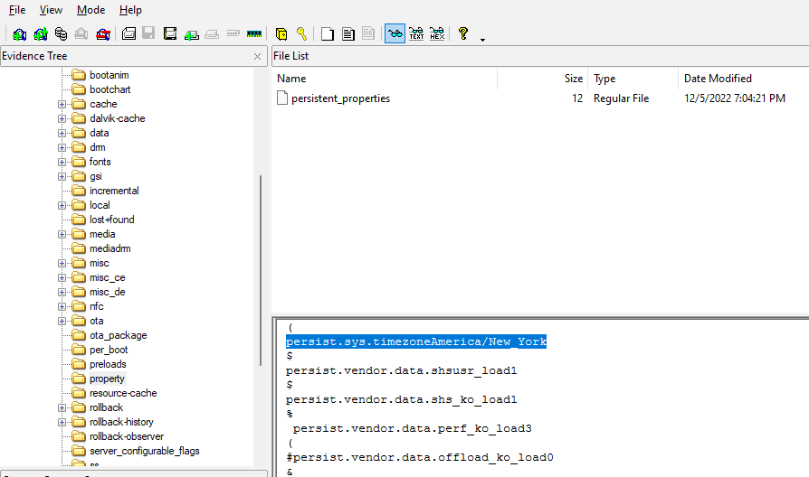

then search on google

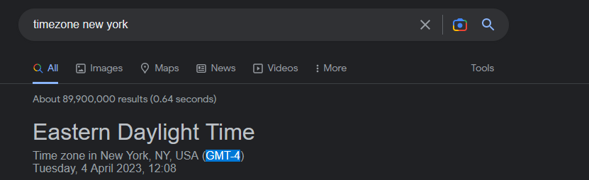

---

## Good Boy (5 pts)

What is the dog's name?
answer: **winston**

**walkthrough :** 
found a dog pic with filename 0kJ_0Gc-Kv_uKDso2Tuy75PvncM.cnt under User contect suspects section on autopsy, export it 

also can be found at /data/media/0/DCIM/Camera where contain some pictures

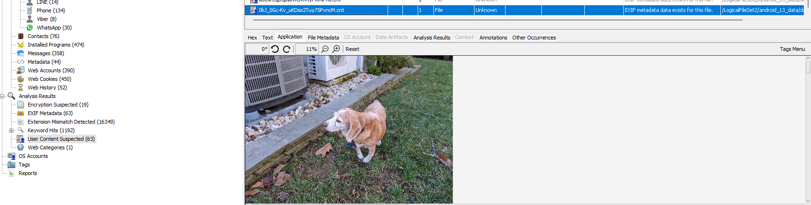

zoom it

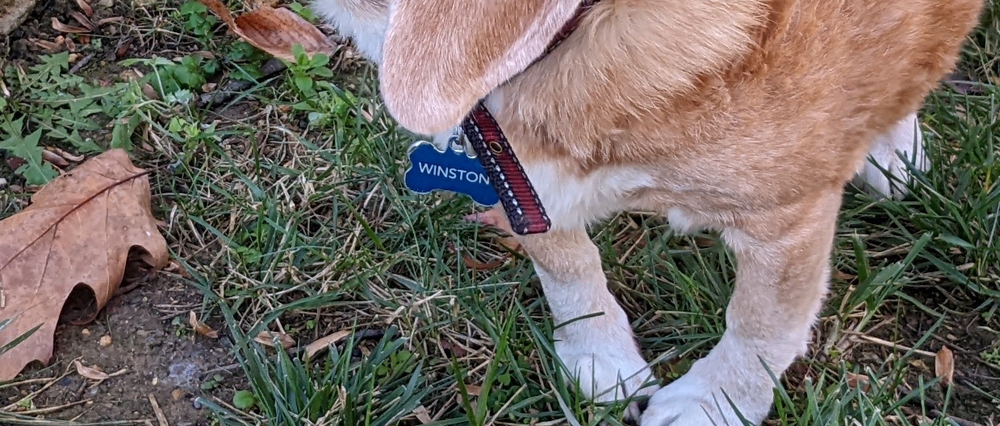

got name on his/her neck

---
## KikIt (5 pts)

What user is the first listed in the suspect's kik chat list?
answer: **thisisdfirtwo_dm7**

**walkthrough :**
under /data/data/kik.android/databases i exported the whole folder and look for kikDatabase.db

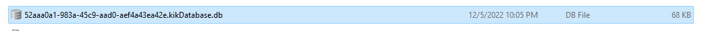

using DB browser >> Browse Data >> messagesTable

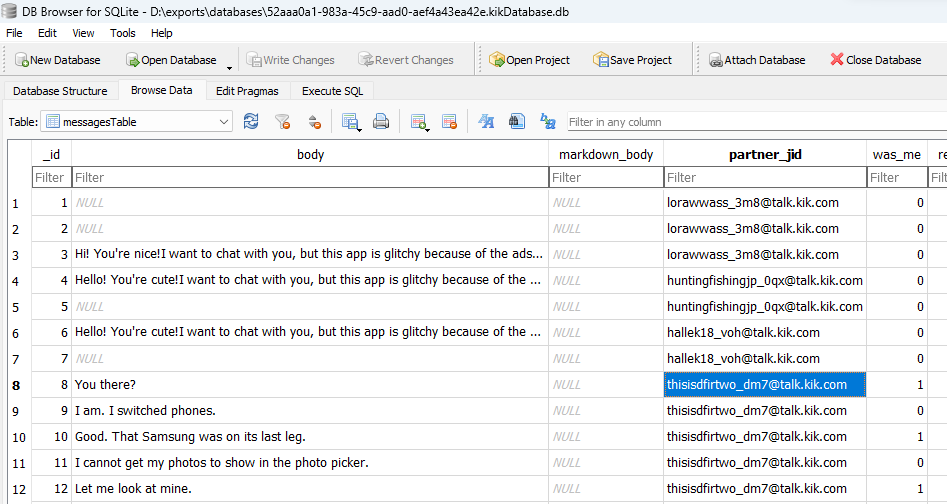

depend on chat you can see
`Hi! You're nice!I want to chat with you, but this app is glitchy because of the ads:( Add me as a friend in the new app It's completely free 😘 my nickname hotgirl23, i wait for you here   `

this kind of message is popular its like spam message

but under user thisisdfirtwo_dm7@talk.kik.com
you can see there some suspicous in his message he was asking for pictures.

resources : https://belkasoft.com/kik-forensics


---
## Party Hard (5 pts)

What was the name of the city that a suspect saw a concert in?
answer: **Raleigh**


**walkthrough :**
this about looking suspicious content like pictures, and i looked at /data/media/0/DCIM/Camera and found about concert pictures, so i just checked its metadata and found the city
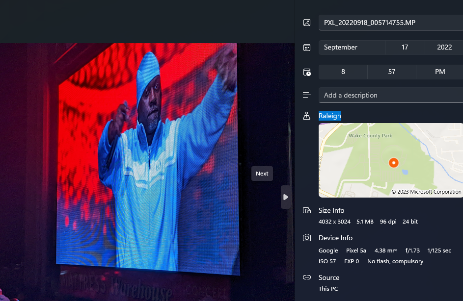

---

## Prefer De'Fer (5 pts)

What is Thom De'Fer's WhatsApp ID?
answer : 19198027080@s.whatsapp.net

**walkthrough :**
this about whatsapp Data so i looked on whatsapp database file
open /data/data/com.whatsapp/databases/wa.db

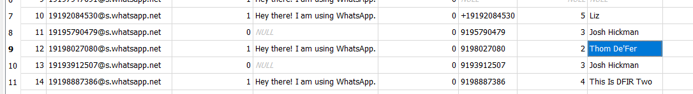

---

## RIP Charger (5 pts)

What date and time (in the phone's local time) did the battery die? (YYYY-MM-DD HH:MM:SS)
answer: **2022-10-04 15:48:43**

**walkthrough :**
you can find android battery shutdown under
/data/system/shutdown-checkpoints on file checkpoints-1664912923093

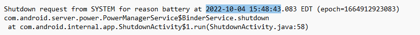

or by using ALEAPP

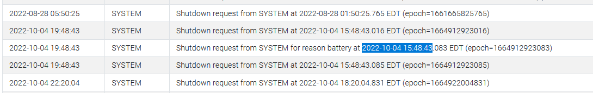


---
## Something in a haystack (5 pts)

What is the name of the file with hash value ad1ee27a4e5bb35358e627266d721e4d?
answer: **pins**

**walkthrough :**
using hashdeep tools

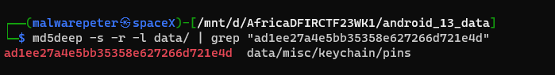


---

## &more&more (7 pts)

The suspect searched for a website, and then immediately visited the website. In the search URL what is the client paramater set to?
answer: **ms-opera-mobile**

**walkthrough :**
checking for history file
/data/user/0/com.opera.browser/app_opera/History
using DB browser >> Browse Data >> urls

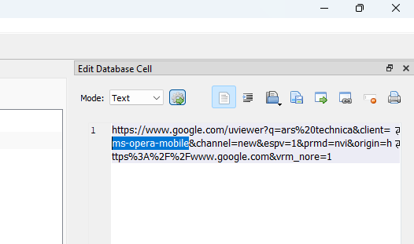

---

## Bankery (7 pts)

What is the value of the bank cookie?
answer : **F9T4Fzg7NWlSEAFp**

**walkthrough :**
you can find firefox cookies under

/data/user/0/org.mozilla.firefox/files/mozilla/torpxars.default/cookies.sqlite you can open it with DB sqlite browser to open it
or using ALEAPP under firefox - Cookies tab you can search a word bank and this below will pop up

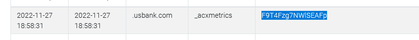

---

## Keeping Secrets (7 pts)
The suspect appears to be using an enterprise encrypted chat program. What is the suspect's password to the program?
answ: **dummyPassword**

**walkthrough :**
using Autopsy under credentials found

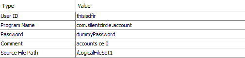

---

## Routinely (7 pts)

What was the date of the last Whoop Cycle update? (YYYY-MM-DD)
answer: **2022-11-05**

**walkthrough :**
under **/data/user/0/com.whoop.android/databases/cycles.db** contain cycles updates information, you can open using DB browser for sqlite

---

## Too Many Apps (7 pts)

What was the last social media app to be installed on the suspects phone?
answer: **truthsocial**

**walkthrough :**
using ALEAPP in installed App i can see latest social APP installed was Truth Social

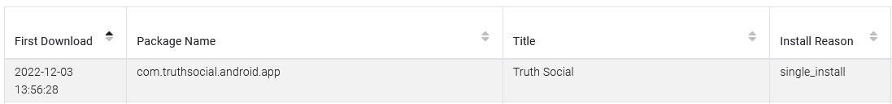


---

## Vibin' (7 pts)

The first incoming Viber call came from which number?
answer : **+19198887386**

**walkthrough :**
look at /data/user/0/com.viber.voip/databases/viber_data

or using ALEAPP under Viber Call Logs report

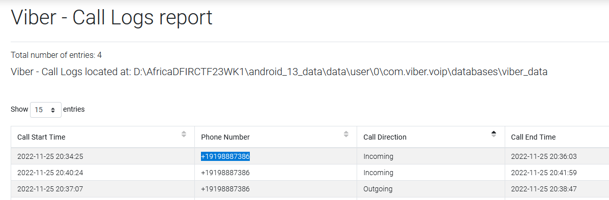

---

## Who's Calling (7 pts)

What is the suspect's extra, fake phone number?
answer : **+19102484781**

**walkthrough :**
seems suspicious installed app for the second number and its data can be found under
/data/user/0/com.adhoclabs.burner/databases/burners.db
or 
using ALEAPP under Burner Number information 

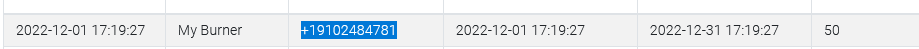

---

## Connxon (10 pts)

What IP address was the suspect using on 2022-08-16?
answer : **172.102.15.75**

**walkthrough :**
after some search i just found this message under Line app it says my account is used in another devices , luckly they collected IP adress and that was an answer, i used ALEAPP for this under Line -Messages tab

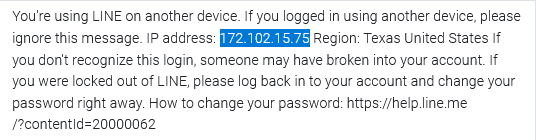

---

## Dream Big (10 pts)

How much higher is Pac Man than the street?
answer : **6.8**

this was painful question i had no idea how to get but on next week i got hint that i should look on altitude , so that comes in mind that i should check pictures altitude, but how? here what i i did with try and error

**walkthough**
first : i checked a pacman picture altitude


using exiftool

```
┌──(malwarepeter㉿spaceX)-[/mnt/d/AfricaDFIRCTF23WK1/android_13_data/data/media/0/DCIM/Camera]
└─$ exiftool PXL_20220816_221104661.jpg | grep "GPS Altitude"
GPS Altitude Ref                : Above Sea Level
GPS Altitude                    : 128.1 m Above Sea Level
```

enter 128.1 as answer : **i got incorrect**

step 2 : from question "How much higher is Pac Man than the street?" well that means its their different from pacman to street but how? substitute a altitude ?

so i assumed the street is from this pic since it show outside


check its altitude

```
┌──(malwarepeter㉿spaceX)-[/mnt/d/AfricaDFIRCTF23WK1/android_13_data/data/media/0/DCIM/Camera]
└─$ exiftool PXL_20220817_001701864.jpg | grep "GPS Altitude"
GPS Altitude Ref                : Above Sea Level
GPS Altitude                    : 121.2 m Above Sea Level
```

substitute

128.1  - 121.2 = 6.9

enter 6.9 as answer : **got incorrect again**

what now bruteforce? no way

step 3 : back to question again , now there other pics look like conference room maybe i should check them from there to the street, which is below

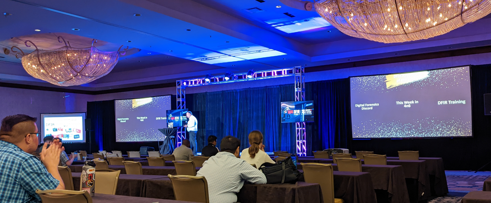

using exiftool

```
┌──(malwarepeter㉿spaceX)-[/mnt/d/AfricaDFIRCTF23WK1/android_13_data/data/media/0/DCIM/Camera]
└─$ exiftool PXL_20220816_215313565.MP.jpg | grep "GPS Altitude"
GPS Altitude Ref                : Above Sea Level
GPS Altitude                    : 128 m Above Sea Level
```

well, looks like same floor on pacman picture
now 128 - 121.2 = 6.8

enter the answer : **CORRECT**

that was real DREAM BIG as its name say

---
## Proton Power (10 pts)

Who did [ThisIsDFIRTwo@protonmail.com](mailto:ThisIsDFIRTwo@protonmail.com) receive an email from? (email address)
answer : thisisdfir@protonmail.com

**walkthrough :**
i just checked on proton email and i found this email adress and that was answer
and because  it is the only account suspicious he was sending and receiving message in protonmail

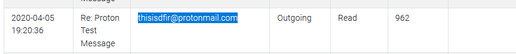

---

## Sudo Social (10 pts)

The suspect posted the attached picture to social media. Which social media network did they post it to?


answer :  **infosec.exchange**

**walkthrough :**
Took so long too on this question,
but after time i looked on mastodon timeline i found the same pic ad above

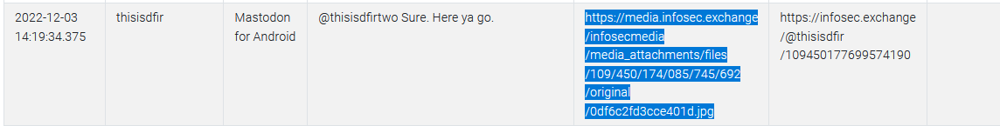

url : https://media.infosec.exchange/infosecmedia/media_attachments/files/109/450/174/085/745/692/original/0df6c2fd3cce401d.jpg

since its **mastodon** a alias name of **infosec.exchange** the answer is **infosec.exchange**
 after try and error

---

## final for week one

i have learnt alot about Android Forensic on this week, thanks to joshua and UNODC team for this competition

week Two - iphone Forensic soon ..

## reference
- https://unix.stackexchange.com/questions/35832/how-do-i-get-the-md5-sum-of-a-directorys-contents-as-one-sum
- https://github.com/abrignoni/ALEAPP
- https://github.com/abrignoni/iLEAPP
- https://www.sciencedirect.com/science/article/abs/pii/S1742287614000449

## DATA
can be found here if you wanna play with it 

WK01 Data: Android Dump (18GB)
 - torrent : https://archive.org/download/AfricaDFIRCTF23WK1/AfricaDFIRCTF23WK1_archive.torrent
 - direct : https://archive.org/download/AfricaDFIRCTF23WK1/android_13_data.tar.gz

since its big file, use torrent to avoid file to be broken when downloading using direct